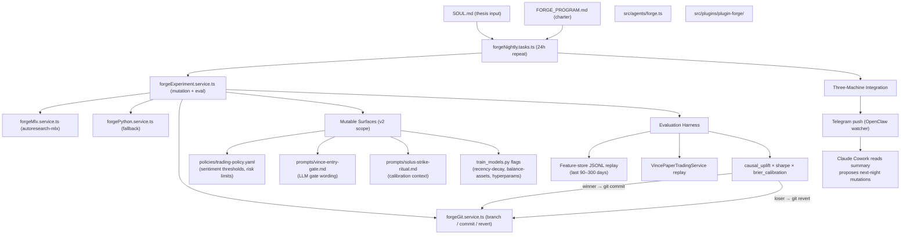

# PRD: Forge — The MLX Autoresearch Layer (VINCE v2)

## v2 Context

This PRD is Priority 1 of the VINCE v2 refactor. The refactor is already underway:

- Kelly, Eliza, Sentinel, Clawterm, Naval → moved out to OpenClaw / Claude Code skills
- Memes, NFTs, Polymarket active dev → removed or stubbed
- Echo / x-researcher → moving to Dexter as a skill
- Solus, VINCE, Otaku → the three core agents that stay
- SOUL.md → expanding from communication style to investment thesis primitive
- Frontend → becomes the terminal for a three-repo stack (VINCE + Dexter + AIHF)
- Live execution → spinning out to a standalone repo (agent-cli or perp-cli, open decision)

Forge is the overnight intelligence layer that makes the leaner, sharper v2 system compound faster.

## Problem

VINCE's ML layer (XGBoost → ONNX, Thompson Sampling, Bayesian tuning) self-improves model weights and 15 genome params. The reasoning layer above it — agent prompts, policy gate thresholds, swarm consensus rules, feature engineering choices — is static. Nobody is running experiments on whether slightly different wording of the sentiment-gate prompt would improve trade quality. Nobody is grid-searching `--recency-decay` combinations against the full feature-store replay. Forge automates both.

In v2, the problem is narrower and cleaner: with only three core agents (VINCE, Solus, Otaku), every mutable surface directly affects PnL, Brier calibration, or execution quality. There is no lifestyle dilution, no memes noise, no Oracle latency arb to distract the metric.

## Goal

Every night, Forge runs hundreds of replay experiments on Apple Silicon (or Python fallback), mutates one surface at a time, measures `causal_uplift × sharpe × brier_calibration`, and commits only winners. You wake up to tighter gates and a one-paragraph summary in Telegram. One `git revert` to undo anything.

The flywheel score is dropped as a metric component in v2 (Kelly is gone; the flywheel was always diluted by non-trading signals). The replacement third axis is `brier_calibration` — Solus's prediction accuracy on Hypersurface options — which ties the composite metric to all three curves: left (VINCE perps), right (Solus options), and ML backbone.

## Success Metrics

- Net positive delta on `causal_uplift × sharpe × brier_calibration` after each overnight run
- Zero regressions to any safety gate (Forge auto-reverts if any gate weakens)
- Daily Telegram push: `Forge: N experiments / M winners / Δmetric +X.XX`
- Claude Cowork (laptop-open operator layer) can read the summary and propose next-night mutations in `FORGE_PROGRAM.md`

---

## Architecture




---

## New and Modified Files

### Foundation (create first)

**[policies/trading-policy.yaml](policies/trading-policy.yaml)** (new — repo root)

Canonical source of truth for policy thresholds. Currently scattered across `vinceSentimentGate.ts`, `paperTradingDefaults.ts`, `dynamicConfig.ts`. Extract key values here:

```yaml
# VINCE trading policy — source of truth for Forge experiments
sentiment_gate:
  bearish_threshold: 4       # score < this → skip longs
  bullish_threshold: 7       # score > this → full size
  bearish_size_multiplier: 0.8
  risk_off_size_multiplier: 0.5
  cache_staleness_minutes: 20

position_limits:
  max_single_trade_usd: 10000
  max_open_positions: 5
  aggressive_margin_usd: 1000
  aggressive_base_size_pct: 12

ml_gate:
  signal_quality_threshold: 0.60
  swarm_min_confidence: 0.50
```

**[prompts/](prompts/)** directory (new — repo root)

Extracts inline LLM prompts from service code into standalone files Forge can mutate cleanly:

- `prompts/vince-entry-gate.md` — the APPROVE/VETO gate prompt (from `vincePaperTrading.service.ts`)
- `prompts/solus-strike-ritual.md` — Solus calibration context injection (from `plugin-solus`)
- `prompts/forge-summary.md` — template for nightly Telegram push

### Agent

**[src/agents/forge.ts](src/agents/forge.ts)** (new)

- Pattern: identical to `sentinel.ts` (Anthropic large + OpenAI embeddings)
- System prompt: "autonomous research layer — mutate, measure, commit. Never touch real capital."
- Knowledge dirs: `internal-docs`, `teammate` (reads SOUL.md for thesis context)
- Plugins: sqlPlugin, bootstrapPlugin, anthropicPlugin, openaiPlugin, forgePlugin, interAgentPlugin
- `shouldRespondOnlyToMentions: true` — silent by default; only speaks when asked or to push nightly summary

**[src/agents/index.ts](src/agents/index.ts)** (modify)

- Add `forgeCharacter` export
- Note: as v2 agent removals land (Sentinel, Eliza, Clawterm, Kelly, Naval), their exports move out of this file. This PRD only handles adding Forge.

### Plugin

**[src/plugins/plugin-forge/src/index.ts](src/plugins/plugin-forge/src/index.ts)**

Exports `forgePlugin: Plugin` with:

**Actions** (3):

- `FORGE_RUN` — "run forge now" manual trigger; bypasses `FORGE_ENABLED` check for operator
- `FORGE_REPORT` — "what did forge do last night?" → reads last leaderboard entry from git log
- `FORGE_REVERT` — "revert last forge run" → `git revert` the last `forge/experiment-`* merge

**Services** (4):

- `forgeExperiment.service.ts` — orchestrates the full mutation → eval → score → commit/revert cycle. Reads `policies/trading-policy.yaml` and `prompts/` as its mutation targets. Respects `FORGE_BUDGET_MINUTES`.
- `forgeMlx.service.ts` — spawns `src/tools/forge/autoresearch-mlx/` as a subprocess with VINCE's composite metric replacing the upstream default
- `forgePython.service.ts` — fallback on non-Apple-Silicon; wraps existing `train_models.py` grid search
- `forgeGit.service.ts` — `git checkout -b forge/experiment-YYYYMMDD-NNN`, cherry-pick winners, auto-revert on regression

**Tasks** (1):

- `forgeNightly.tasks.ts` — recurring 24h task at `FORGE_NIGHTLY_HOUR_UTC` (default 3am UTC). Pattern: identical to `sentinelWeekly.tasks.ts`. Reads `SOUL.md` for thesis context. Pushes Telegram summary when complete (if `FORGE_TELEGRAM_PUSH=true`). No-ops if `FORGE_ENABLED=false`.

### Charter

**[docs/FORGE_PROGRAM.md](docs/FORGE_PROGRAM.md)** (new)

```
VINCE Forge — Research Org Charter

Goal:
  Maximize causal_uplift × sharpe × brier_calibration
  while preserving all safety gate integrity.

Thesis input:
  Read knowledge/teammate/SOUL.md before each run.
  Prioritize experiments on surfaces most relevant to the current thesis stance.

Mutable surfaces (v2 scope — three core agents only):
  1. policies/trading-policy.yaml
     (sentiment thresholds, risk limits, ML gate parameters)
  2. prompts/vince-entry-gate.md
     (VINCE LLM gate approve/veto wording)
  3. prompts/solus-strike-ritual.md
     (Solus calibration context and strike ritual prompt)
  4. train_models.py invocation flags
     (--recency-decay, --balance-assets, --tune-hyperparams combinations)

NOT mutable (locked):
  - Core safety limits (hard position caps, circuit-breaker thresholds)
  - Otaku execution paths (no modification to openTrade() or wallet logic)
  - ERC-8004 identity registration logic (Otaku Phase 3 surface — evaluate separately)
  - Any execution repo files (agent-cli / perp-cli — out of scope until decision is final)

Evaluation:
  Full replay on feature-store JSONL (last 90–300 days).
  Paper-bot simulation via VincePaperTradingService.
  Compute causal_uplift, sharpe, and brier_calibration on holdout window.

Budget: FORGE_BUDGET_MINUTES (default 300). Hard kill after budget.
Safety: auto-revert the entire experiment if:
  - composite metric regresses >2% vs baseline
  - any safety gate threshold weakens
  - hard position cap or circuit-breaker threshold changes

Output:
  - git commit on winners (forge/experiment-YYYYMMDD-NNN branch → merge)
  - Telegram push: "N experiments / M winners / Δmetric / safety: ✓"
  - docs/forge-leaderboard.md entry (one line per night, cumulative)
```

### Tooling

`**src/tools/forge/autoresearch-mlx/**` (git submodule)

- Source: `https://github.com/trevin-creator/autoresearch-mlx`
- Upstream metric replaced with `causal_uplift × sharpe × brier_calibration`
- Evaluation function wired to `forgeExperiment.service.ts` replay harness

### Docs

- **[docs/FORGE.md](docs/FORGE.md)** (new) — standard agent brief: can/cannot, key files, PRD focus, SOUL.md input
- **[docs/AGENTS_INDEX.md](docs/AGENTS_INDEX.md)** (modify) — add Forge row
- **[CLAUDE.md](CLAUDE.md)** (modify) — add Forge to agent map table

---

## Env Vars (add to .env.example between SENTINEL and CLAWTERM sections)

```bash
# FORGE — MLX Autoresearch Layer (Priority 1 VINCE v2)
# Enable after 300+ closed trades. Default: false.
FORGE_ENABLED=false
# "mlx" for Apple Silicon (M2/M3/M4), "python" for fallback
FORGE_RUNTIME=mlx
# Max nightly window in minutes (default 5 hours)
FORGE_BUDGET_MINUTES=300
# Composite metric to optimize
FORGE_TARGET_METRIC=causal_uplift_sharpe_brier
# UTC hour to run the nightly task (default 3am)
FORGE_NIGHTLY_HOUR_UTC=3
# Push nightly summary to Telegram via OpenClaw watcher
FORGE_TELEGRAM_PUSH=true
# No Discord for Forge — it's silent. Reports via Telegram + FORGE_REPORT action.
```

No `FORGE_DISCORD_*` vars. In v2 with a leaner roster, Forge does not need its own Discord channel. It speaks only when asked (`FORGE_REPORT` action) or pushes to Telegram.

---

## Mutable Surfaces — v2 Scope

Phase 1 surfaces (three core agents only; no Kelly, Eliza, Sentinel, Oracle, memes):


| Surface                   | File                                 | How Forge mutates                                                                                  |
| ------------------------- | ------------------------------------ | -------------------------------------------------------------------------------------------------- |
| Sentiment gate thresholds | `policies/trading-policy.yaml`       | Vary `bearish_threshold` ±0.5, `risk_off_size_multiplier` ±0.1, replay, compare                    |
| ML gate threshold         | `policies/trading-policy.yaml`       | Vary `signal_quality_threshold` from 0.45–0.70 in 0.05 steps                                       |
| VINCE entry-gate prompt   | `prompts/vince-entry-gate.md`        | Mutate APPROVE/VETO framing, replay, measure gate pass rate and PnL delta                          |
| Solus calibration context | `prompts/solus-strike-ritual.md`     | Vary Brier score emphasis, tail risk wording, measure calibration delta                            |
| train_models.py flags     | `scripts/train_models.py` invocation | Grid search: `--recency-decay` (0.90–0.99), `--balance-assets` on/off, `--tune-hyperparams` on/off |


Phase 2 (after 50+ committed wins):

- Swarm consensus rules: VINCE ↔ Solus handoff timing, when Solus calibration score overrides VINCE's perps gate
- ONNX architecture: number of estimators, max depth, feature selection for `signal_quality.onnx`

Phase 3 (after execution layer decision is final):

- Execution policy files in agent-cli or perp-cli repo — Forge proposes mutations, human reviews before merge
- Otaku ERC-8004 reputation registration logic — when to publish a Brier score on-chain

---

## Three-Machine Integration

Forge is the overnight layer in the three-machine stack:

```
Perplexity (always on)
  └─ researches regime shifts, feeds Dexter thesis layer

Claude Cowork (laptop open)
  └─ reads Forge's nightly Telegram summary
  └─ proposes next-night mutations to FORGE_PROGRAM.md
  └─ interprets winning diffs and decides whether to expand scope

OpenClaw (always-on daemon, $5/month server)
  └─ Forge watcher: polls docs/forge-leaderboard.md nightly
  └─ pushes "X experiments / Y committed / Δmetric" to Telegram
  └─ Forge is the reason OpenClaw needs to stay running even when laptop is closed
```

The Telegram push format:

```
Forge — [date]
Experiments: 147 | Winners: 3 | Reverts: 144
Δ causal_uplift: +0.04 | Δ sharpe: +0.11 | Δ brier: +0.02
Best: policies/trading-policy.yaml → bearish_threshold 4.0→3.5
Safety: ✓ all gates preserved
Branch: forge/experiment-20260312-003 merged
```

Claude Cowork reads this, decides whether the winning direction warrants expanding scope (e.g., "try 3.0 tomorrow"), and edits `FORGE_PROGRAM.md` accordingly. This is the human-in-the-loop for the reasoning layer.

---

## v2 Agent Roster (updated)


| Agent     | v2 Status        | Notes                                |
| --------- | ---------------- | ------------------------------------ |
| **VINCE** | ✅ Core           | Data feed, paper bot, perps          |
| **Solus** | ✅ Core           | Hypersurface options, all focus      |
| **Otaku** | ✅ Core, reframed | ERC-8004 identity + x402 skills      |
| **Forge** | ✅ NEW            | MLX autoresearch layer               |
| Echo      | ⏸️ Stub          | x-researcher → Dexter skill (future) |
| Oracle    | ⏸️ Stub          | Deprioritized, no active dev         |
| Kelly     | ➡️ Moving out    | OpenClaw daemon                      |
| Eliza     | ➡️ Moving out    | Perplexity → Cowork pipeline         |
| Sentinel  | ➡️ Moving out    | Claude Code / Codex skill            |
| Clawterm  | ➡️ Moving out    | Claude Code / Codex skill            |
| Naval     | ➡️ Evaluate      | Philosophy → Dexter SOUL.md review   |


This PRD only adds Forge. The agent removals happen as separate v2 refactor PRDs. `src/agents/index.ts` still exports all agents today; removals are sequenced separately.

---

## Safety Guardrails

- `FORGE_ENABLED=false` default — operator opts in after 300+ closed trades (same bar as ONNX)
- Forge never calls `openTrade()`, never touches Otaku wallet paths, never writes to live order book
- Experiments run on historical feature-store JSONL only — no live market API calls during eval
- Every experiment runs in a `forge/experiment-YYYYMMDD-NNN` git branch — main is never touched directly
- Auto-revert if: composite metric regresses >2%, OR any safety gate threshold weakens, OR hard cap changes
- Budget hard kill: `FORGE_BUDGET_MINUTES` enforced by process timeout in `forgeExperiment.service.ts`
- Telegram push includes safety gate delta line — operator sees any regression before opening laptop

---

## Phased Rollout

**Phase 0 (this weekend):** Skeleton only. Create `policies/trading-policy.yaml`, `prompts/` dir, plugin-forge structure, `FORGE_PROGRAM.md`, env vars, `forge.ts` agent, nightly task (no-op that logs "Forge offline"). Forge appears in the agent map and standup as "offline — waiting for 300 closed trades."

**Phase 1 (after 300 closed trades):** First live experiment surface — `policies/trading-policy.yaml` sentinel gate thresholds. Eval harness wired to feature-store replay. MLX subprocess connected. Nightly task live.

**Phase 2 (after 50 committed wins):** Expand to all Phase-1 surfaces (prompts + train_models.py flags). Leaderboard entry written to `docs/forge-leaderboard.md`. Claude Cowork begins proposing next-night scope.

**Phase 3 (after execution layer decision):** Execution policy surface added. Otaku ERC-8004 surface evaluated. Forge begins proposing PRDs for human review.

---

## Open Questions

- **SOUL.md expansion for v2** — currently `knowledge/teammate/SOUL.md` encodes communication style. In v2 it will also encode investment thesis (BTC-core stance, regime preferences, risk tolerance). Forge reads it as thesis context. A separate v2 task should document the new SOUL.md fields before Phase 1.
- **Dexter integration** — the v2 README describes Dexter as a companion repo but it does not exist in this codebase yet. Forge's composite metric will optionally pull Dexter regime + AIHF conviction as replay context when that integration lands. Phase 0 does not depend on it.
- **Execution layer** — `agent-cli` vs `perp-cli` decision is open. Phase 3 surfaces depend on this. Forge Phase 0-2 are fully independent of the choice.
- **Standup update scope** — in v2, Sentinel, Clawterm, Eliza, Kelly, and Naval are moving out. The standup template in `plugin-inter-agent/standup/` will need a v2-scoped rewrite. That is a separate v2 refactor task; this PRD only adds line 7 (Forge) to the current template.

