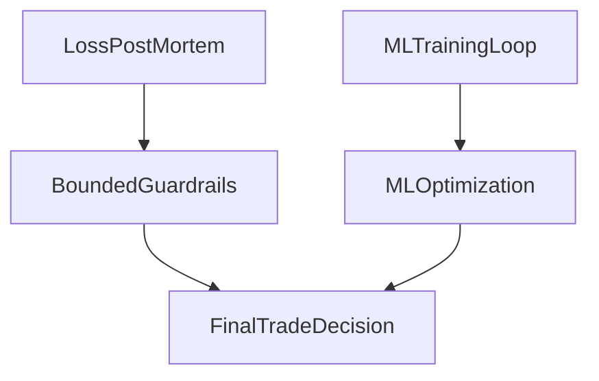

<div align="center">

# VINCE

```
  ██╗   ██╗██╗███╗   ██╗ ██████╗███████╗
  ██║   ██║██║████╗  ██║██╔════╝██╔════╝
  ██║   ██║██║██╔██╗ ██║██║     █████╗
  ╚██╗ ██╔╝██║██║╚██╗██║██║     ██╔══╝
   ╚████╔╝ ██║██║ ╚████║╚██████╗███████╗
    ╚═══╝  ╚═╝╚═╝  ╚═══╝ ╚═════╝╚══════╝
```

### _Push, not pull._

**Unified data intelligence** for options, perps, memes, DeFi, lifestyle, and NFT floors, with a **self-improving paper trading bot** at the core. Ten agents, one team, one dream. No hype, no shilling, no timing the market.

</div>

---

## What We Built: One-Month Hackathon

**V4.2.0 — The Genome.** One month. One PRD. Phases 1-5 shipped end-to-end.  
Then we finished phases 6-15 and closed the loop.  
VINCE now learns from outcomes, grades its own proof, and scales risk only when evidence is strong.

### Build arc: 15 phases, one machine

VINCE is not a group of smart bots anymore.  
It is one operating machine: research → decision → trade → attribution → policy update.

Phases 1-4: spine - clean handoffs, shared scorecards, regime-aware gates.  
Phases 5-9: adaptation - strategy evolution, adversarial checks, calibration tracking, research-to-trade telemetry.  
Phases 10-12: control - policy guardrails, rollback paths, operator visibility.  
Phase 13: consensus - reliability-aware trade gating across agents, not single-model confidence.  
Phases 14-15: discipline - proof attribution, sufficiency grading, source-quality controls, causal-confidence gates.

### Why this matters

Most systems scale on vibes.  
We scale on proof.  

Promotion requires sufficiency and causal confidence, not headline uplift.  
Every trade updates attribution, calibration, and policy.  
Public claims pass verified thresholds before distribution.  
Rollout stays staged (`observe_only` → `recommendation` → guarded `auto_apply`) with rollback drills.

### Phase-15 status snapshot

- `/vince/paper` exposes `causal30d`, `sufficiencyTasks`, and `solus30d` in `proofSummary`.
- Allocator hardening is live with a causal-confidence gate and rollback-aware reduction path.
- Sufficiency v2 scores sample size, asset and regime breadth, time coverage, regime depth, and variance context.
- Source quality v2 adds lag-aware scoring, dominant-regime tagging, cooldown windows, and hysteresis.
- Verified artifacts are written to `.elizadb/vince-paper-bot/verified-claims.json` and `.elizadb/vince-paper-bot/sufficiency-tasks.json`.

### Read more (detailed docs)

- Detailed phase-by-phase overview: [PHASES_1_15_DETAILED.md](docs/PHASES_1_15_DETAILED.md)
- Phase 14 PRD: [PRD_PHASE_14_PROOF_TO_CAPITAL_ENGINE.md](docs/standup/prds/PRD_PHASE_14_PROOF_TO_CAPITAL_ENGINE.md)
- Phase 15 operational runbook: [PHASE_15_7DAY_RUNBOOK.md](docs/standup/prds/PHASE_15_7DAY_RUNBOOK.md)

### Prior releases

Earlier versions shipped the paper bot ML loop (feature store, ONNX, VinceBench), HIP-3 spot tokens alongside Hyperliquid perps, the Polymarket edge engine (three strategies, Kelly-sized), zero AI slop across all ten agents, the leaderboard with cost transparency, and the content flywheel (Eliza publishing real results to Substack).

Releases: [v4.2.0](https://github.com/IkigaiLabsETH/vince/releases/tag/v4.2.0) · [v4.0.0](https://github.com/IkigaiLabsETH/vince/releases/tag/v4.0.0) · [v3.7](https://github.com/IkigaiLabsETH/vince/releases/tag/v3.7) · [v3.6](https://github.com/IkigaiLabsETH/vince/releases/tag/v3.6.0) · [v3.4](https://github.com/IkigaiLabsETH/vince/releases/tag/v3.4.0) · [v3.3](https://github.com/IkigaiLabsETH/vince/releases/tag/v3.3.0) · [Tags](https://github.com/IkigaiLabsETH/vince/tags) · [Changelog](CHANGELOG.md)

---

## Why

Modern markets are machine-speed. Human-only workflows are not enough.

For decades, investors could win with access, judgment, and patience. That edge shrank as information latency collapsed.

Now, information is repriced in milliseconds. If your process depends on manual interpretation and manual execution, you are late by default.

The durable edge today is code: repeatable process, broad coverage, and zero emotional drift.

Renaissance's Medallion is the clearest proof point: roughly 39% annualized since the late 1980s, about 2x the S&P 500 over the same era. It closed to outside capital in 1993 because extra size would dilute edge. Berkshire's audited long-run record is roughly 19.9% annualized in the same period.

Medallion won by repeating small statistical edges across many instruments with discipline. Humans can track a handful of positions. Code can monitor thousands, react in milliseconds, and execute the same playbook without fatigue.

### The foundations

Three breakthroughs between 1952 and 1973 made automation inevitable:

1. **1952** — Harry Markowitz proved portfolio construction could be mathematical.
2. **1964** — William Sharpe introduced CAPM: a way to measure risk, compare returns to a benchmark, and quantify performance.
3. **1973** — Fischer Black and Myron Scholes published the Black-Scholes equation for pricing options, replacing human estimation with formulas.

To automate investing, you need clear inputs, measurable outputs, rules that do not depend on judgment calls, and formulas that adapt with data. Black-Scholes delivered that framework.

Edward Thorp proved these ideas in live markets at Princeton/Newport. Jim Simons scaled them at Renaissance.

### Five levels of autonomous investing

| Level | Name | Edge |
| :--- | :--- | :--- |
| **1** | Manual | Information scarcity. Who you knew, what you believed, whether you had the conviction to act. |
| **2** | Algorithmic | Pre-defined rules execute automatically. Speed and discipline, no learning. |
| **3** | Automated | Integrated workflows: data feeds, portfolio models, execution. Reduced friction, no intelligence added. |
| **4** | Autonomous | ML models that update on new data without explicit reprogramming. |
| **5** | Agentic AI | Plans, chooses actions, uses tools, monitors outcomes, and self-corrects across multi-step workflows. |

### Where VINCE sits

VINCE is built at **Level 5**. Ten agents research, analyze, paper-trade, evaluate outcomes, and improve their own models. No human in the loop for signal generation, position sizing, or risk management. The paper bot trains in production, writes to the feature store, and deploys ONNX models back into the decision loop.

The move from Level 1 to Level 5 is not anti-human. It is pro-process. Advantage moved from information access to integrated research, risk, and execution that runs 24/7.

Goal: stay in the game without living on screens. Push, not pull.

---

## The Team

Clear lanes, no overlap: data, plan, call, lifestyle, infra.

| Agent | Lane |
| :--- | :--- |
| **Eliza** | Knowledge, research, brainstorm, Substack content. WRITE_ESSAY, DRAFT_TWEETS, CONTENT_AUDIT. The base everything builds on; next: Substack gold + banger tweets for X. |
| **VINCE** | Objective data: options, perps, memes, news, paper bot, 15+ signal sources. Push, not pull. |
| **ECHO** | CT sentiment, X research, social alpha, contrarian flags. Your ears on X; insight quality from X is a focus for improvement. |
| **Oracle** | Prediction markets: Polymarket discovery, odds, portfolio (read-only). Polymarket insight depth is a focus for improvement. |
| **Solus** | Hypersurface options: strike ritual, optimal strike, assignment prob (GBM + ML when ONNX loaded). Brier calibration, auto-record, Friday resolve reminder; tail risk & portfolio copula. **RecursiveLoop + ML:** calibration context and TRAIN_SOLUS_CALIBRATION_WHEN_READY so Solus gets better over time for onchain options. [SOLUS.md](docs/SOLUS.md) |
| **Otaku** | **Only agent with a wallet.** Morpho, CDP, Bankr, Biconomy, Clanker, DefiLlama. Execution graduation (L0→L3). |
| **Kelly** | Touch grass: hotels, fine dining, wine, health, fitness. Standup facilitator. Flywheel score. No trading. |
| **Sentinel** | Ops, cost steward, ONNX, ART, PRDs, OpenClaw guide, collective memory, repo improvements. |
| **Naval** | Philosophy, mental models, standup conclusions. One thesis, one signal, one team one dream. |
| **Clawterm** | AI agents terminal: OpenClaw skills, Milaidy, ElizaOS, setup tips, trending. |

One conversation, ask any teammate by name; standups 2x/day. [MULTI_AGENT.md](docs/MULTI_AGENT.md)

---

### Trading Bot: No Tilt. Every decision explained. Every outcome learned.

The paper bot runs 24/7 on the **Leaderboard** (Trading Bot tab): 15+ signal sources, 38 onchain assets (crypto, stocks, commodities, indices) as Hyperliquid perps. Zero tilt. Every open position shows strength, confidence, sources, and R:R; every close feeds the feature store and ML loop. Goal progress ($420/day, $10K/mo), open positions, recent trades, and signal source status—all in one place. No chat required. [LEADERBOARD.md](docs/LEADERBOARD.md)

**HIP-3 assets** (stocks, commodities, indices on Hyperliquid) are capped at 5x leverage in code; max leverage can be read from the Hyperliquid API when available. New HIP-3 markets are **discovered automatically**: a daily task scans all HIP-3 DEXes, keeps symbols with 24h volume above threshold, and adds new candidates (e.g. RIVN) to [targetAssets.ts](src/plugins/plugin-vince/src/constants/targetAssets.ts) so the bot can trade them. **Beware of low liquidity, high volatility, and increased liquidation risk** on HIP-3 perps (same notice as on Hyperliquid).

---

### Polymarket: paper trading that proves the edge

When spot moves, prediction markets often lag. Oracle runs a **latency arb engine**: Binance spot and Polymarket CLOB in real time, implied probability from the option-like payoff of binary contracts, edge above a threshold, Kelly-sized paper trades. No execution by default—only logs and learns. The goal is to show that the edge is real before a single dollar is at risk. You see whether it's running or paused on the leaderboard Polymarket tab; chat with Oracle for status, pause, or resume. Small edges, captured in code, 24/7.

---

### Solus: Hypersurface options assistant that learns from its own calls

Solus is the **CFO agent** for weekly options on Hypersurface (BTC, ETH, SOL, HYPE). One ask: "optimal strike for BTC" or "strike ritual" and you get a strike call with **assignment probability** (GBM closed-form, or ML-calibrated when the ONNX model is trained on your resolved predictions). No copy/paste: options context is cached and refreshed every 10 minutes, and VINCE’s Deribit data flows in automatically.

Solus **measures itself**. Every strike call can auto-record a prediction; at expiry you resolve ("we got assigned" / "we didn’t"). Brier score over resolved predictions measures calibration. That score and the last 10 outcomes are injected into every optimal-strike and position-assess prompt—so Solus sees its own track record and tempers confidence when it’s been wrong. A Friday reminder nags you to resolve open predictions; a daily task writes calibration notes (e.g. Brier by asset, by IV bucket) into context. When you have 50+ resolved rows, a recurring task trains an ONNX assignment calibrator and the options context switches to ML-calibrated P(assign) for best CC/CSP strikes.

**Tail risk** (e.g. P(spot down 15% in 7d) per asset) and **portfolio assignment risk** (when you have 2+ positions: joint P(at least one assigned), P(all), P(none) via Gaussian copula) are in the same context. No Python subprocess, no new APIs—TypeScript-only on top of existing Deribit data. The quant skill in `skills/quant/` is the reference narrative and math; Solus ships the same ideas in plugin-solus. [docs/SOLUS.md](docs/SOLUS.md) · [plugin-solus/FEATURE-STORE.md](src/plugins/plugin-solus/FEATURE-STORE.md) · [IMPROVEMENT_PROOF.md](src/plugins/plugin-solus/IMPROVEMENT_PROOF.md)

---

## TL;DR

VINCE pushes daily market intel (options, perps, memes, DeFi) to Discord and Slack. One command, **ALOHA**, gives the full read: vibe check + PERPS + OPTIONS + "trade today?".

Underneath is a self-evolving paper bot: ML loop, feature store, ONNX deployment, strategy genome, regime profiles, portfolio construction, and execution graduation. It trains in production and updates parameters weekly.

Kelly runs lifestyle concierge (travel, wine, dining, health, fitness) and tracks the flywheel score. She does not give trading advice.

Every losing trade gets an automated multi-agent post-mortem in `docs/standup/post-mortems/`. `bun run postmortems:ingest` turns those writeups into structured stats, guardrail suggestions, and RAG memory so each loss tightens the next decision.

---

## Getting Started

```bash
bun install
cp .env.example .env   # add API keys
bun run build

elizaos dev            # hot-reload
# or
bun start              # production (Postgres when POSTGRES_URL set)
```

**Web UI:** `bun start` serves the API on port 3000 and the frontend on **5173**. Open http://localhost:5173 for chat and dashboard.

---

## Features

- **ALOHA** — One command: vibe check + PERPS + OPTIONS + "trade today?"
- **Self-evolving paper bot** — End-to-end loop from signal to trade to feature store to training to ONNX deployment. Four models: signal quality, position sizing, TP optimizer, SL optimizer. Rule-based fallbacks keep it live when models are missing. Tune with env vars (ML threshold, swarm confidence, margin/size); see `Paper Bot & ML`.
- **Strategy genome** — 15+ parameters mutate weekly, replay on history, and auto-promote the winner by Sharpe and drawdown.
- **Regime profiles** — Five market personalities auto-shift risk limits, sizing, and signal thresholds from Oracle regime, Echo sentiment, and technicals.
- **Execution graduation** — Otaku earns trust through four levels (paper → notify → confirm → auto), with circuit-breaker demotions.
- **Portfolio construction** — Correlation matrix, heat caps, Kelly sizing, and opportunity-cost checks.
- **Flywheel score** — One 0-100 health score across signal quality, trading performance, sentiment, content, knowledge, and engineering.
- **Solus (Hypersurface)** — Strike ritual + optimal strike + assignment probability (GBM with optional ML). Brier calibration, auto-record, Friday resolve reminder, tail risk, and portfolio copula. Recursive learning. [SOLUS.md](docs/SOLUS.md)
- **Multi-agent** — Ask any teammate by name. Standups run 2x/day. One thread, full team.
- **Leaderboard** — One dashboard for Markets, Memetics, News, Digital Art, Trading Bot, and Knowledge. No chat required. [LEADERBOARD.md](docs/LEADERBOARD.md)
- **Kelly** — Lifestyle concierge only. Daily briefing to channels with "kelly" or "lifestyle". Optional self-modification. [KELLY.md](docs/KELLY.md)
- **Knowledge ingestion** — `VINCE_UPLOAD` and ingest-urls pipeline new information into `knowledge/`.
- **X research** — Paper algo signal + Cursor skill + `VINCE_X_RESEARCH` in chat. [X-RESEARCH.md](docs/X-RESEARCH.md)
- **Proof & next** — Prove recursive improvement for paper bot (HL perps) and Solus (Hypersurface options), improve X and Polymarket insight quality, and sharpen Eliza for Substack + X output. See **What's next**.

---

## Paper Bot & ML

The 12-phase roadmap built this loop; the algo (gates, open/skip, feature store) and the ML pipeline (train → ONNX → report → Sentinel) are documented in [PRD: Paper Trading Algo and ML](docs/standup/prds/PRD_PAPER_TRADING_ALGO_AND_ML.md) and [PRD: ML Training Pipeline](docs/standup/prds/PRD_ML_TRAINING_PIPELINE.md). Signals flow into trades, trades flow into the feature store, the feature store feeds Python training, and ONNX models deploy back to the bot. Four models: signal quality, position sizing, TP optimizer, SL optimizer. When models are missing, **rule-based fallbacks** keep it running (e.g. 60% signal-quality threshold, 0.5–2× position size). The dashboard’s “100 trades processed” is the **Weight Bandit** (Thompson Sampling) count of **closed** trades; ONNX stays “None loaded” until you run training and place the `.onnx` files (and `training_metadata.json`) in `.elizadb/vince-paper-bot/models/` (or the configured models dir).

**VinceBench** scores every closed trade on process quality (signal, risk, timing, regime). The score trains the signal-quality model to learn more from high-quality decisions.

### Recent improvements

- **ONNX export fixed** — Graph and node I/O are renamed to `input`/`output` so onnxruntime loads models reliably; smoke tests run after every export so you see “ONNX smoke test passed” for all four models.
- **Env tuning** — No code changes needed to adjust trade frequency or size: ML threshold, swarm confidence, aggressive margin/size (see table below).
- **Training pipeline** — Sentinel improvement tasks write to `docs/standup/openclaw-queue/` with safe filenames (slashes in feature names no longer break writes). Feature prep uses a single concat for derived columns to avoid DataFrame fragmentation warnings.
- **Paper bot** — Size is capped to the bucket max before the policy check so high-notional assets open at cap instead of being blocked; funnel log includes rejection reasons (e.g. no_primary_signal, sentiment_gate_long, swarm_min_confidence) for tuning visibility. CoinGlass connection test is retried with backoff before falling back to Binance free APIs.

### Paper bot tuning (env)

Tune no-trades vs margin/size without code changes. In `.env` (see `.env.example`):

| Env var | Purpose |
|--------|--------|
| `VINCE_ML_SIGNAL_QUALITY_THRESHOLD` | 0–1. Override ML signal-quality threshold; lower = more trades (e.g. `0.5` when rule-based 60% is too strict). |
| `VINCE_SWARM_ENABLED` | `true` / `false`. Enable swarm consensus gating in the trade loop. |
| `VINCE_SWARM_MIN_CONFIDENCE` | 0–1 (default `0.5`). Min swarm consensus to allow a trade; lower = more trades. |
| `VINCE_AGGRESSIVE_MARGIN_USD` | Fixed margin per trade in aggressive mode (default `1000`). Increase for larger paper size. |
| `VINCE_AGGRESSIVE_BASE_SIZE_PCT` | Base size as % of portfolio when portfolio &lt; margin (default `12`). |
| `VINCE_PAPER_MAX_SINGLE_TRADE_USD` | Paper bucket + policy cap per trade (default `10000`). High-notional assets (e.g. BTC, index products) often hit this; increase or leave unset to use default. |

**Single-trade cap:** The paper bucket and policy rule **max-single-trade-usd** cap each trade at **$10k** by default (see [policies/trading-policy.yaml](policies/trading-policy.yaml) and the paper bucket in [vinceCapitalBuckets.service.ts](src/plugins/plugin-vince/src/services/vinceCapitalBuckets.service.ts), or `capital-buckets.json` when present). If you see "blocked by policy engine: max-single-trade-usd" in logs, the requested size exceeded this cap; set `VINCE_PAPER_MAX_SINGLE_TRADE_USD` to raise it.

Many “no trade” outcomes come from ML quality below threshold, X sentiment not meeting 40% or neutral, confidence/strength below min, or swarm consensus below the min. Use these vars to relax gates for more paper volume or raise margin/size when you want larger positions. If you see many rejections for "ML quality below threshold 60%" and ONNX is not loaded, set `VINCE_ML_SIGNAL_QUALITY_THRESHOLD=0.5` (or 0.45) to allow more trades with rule-based scores.

The **strategy genome** adds a second improvement loop: every week, the genome mutates 15+ parameters, replays against historical feature-store data, ranks variants by Sharpe ratio and max drawdown, and promotes the winner. Regime profiles shift the genome's risk limits and sizing multipliers based on the current market personality.

### Re-run training

```bash
bun run train-models -- --bench-score-weight
```

Or with recency weighting: `bun run train-models:recency`. Output goes to `.elizadb/vince-paper-bot/models/` by default; **restart the agent** so the inference service loads the new ONNX and `training_metadata.json` (and the suggested threshold and suggested_tuning). Optionally run `VINCE_APPLY_IMPROVEMENT_WEIGHTS=true bun run improvement-weights` to update aggregator source weights from the report.

### Recursive improvement loop (autopilot)

The paper bot can **run on autopilot** so it keeps getting better from its own trades:

1. **Trade** → outcomes (open/close, PnL, strength, confidence) are written to the feature store.
2. **Task `TRAIN_ONNX_WHEN_READY`** runs every 12h; when there are **90+ complete trades**, it runs `train_models.py` (at most once per 24h).
3. **New ONNX models** and `training_metadata.json` (threshold, suggested_tuning, holdout_metrics) are written; on Cloud the task uploads to Supabase and calls `reloadModels()` so new models apply without restart.
4. **Optional:** Set `VINCE_APPLY_IMPROVEMENT_WEIGHTS=true` so the task **applies source weights** from the improvement report after each successful training run. No extra script—weights update automatically and the next evaluation cycle uses them.
5. **Next cycle** uses updated thresholds, TP/SL from ONNX, and (if applied) updated aggregator weights → more/better data → repeat.

So: **trades → features → train → new models + weights → better decisions → more trades** is a **recursive loop** that runs without manual steps once the agent is up and the env flag is set. See [ML_IMPROVEMENT_PROOF.md](src/plugins/plugin-vince/ML_IMPROVEMENT_PROOF.md) for how we **prove** the loop improves the bot.

### ML loop vs post-mortem loop (simple)

Both loops are recursive, but they do different jobs:

- **ML loop = performance engine.** It learns from many trades and predicts better signal quality, size, and TP/SL behavior.
- **Post-mortem loop = safety engine.** It learns from losses and applies bounded guardrails (for example: lower leverage cap, minimum stop-vs-ATR floor), then validates and rolls back if results do not improve.

Think of it this way:

- ML says: "Within our rules, what is the best move?"
- Post-mortem policy says: "What mistakes are temporarily off-limits until proven safe again?"

They are **complementary**, not conflicting, because of precedence:

1. Hard risk limits and policy guardrails (including post-mortem candidate overlays)
2. Policy engine checks (block/warn/size-reduce)
3. ML optimization inside those limits

This avoids double-counting risk while still allowing ML to improve decisions. If a post-mortem policy hurts outcomes, the candidate is rolled back automatically.



### Improving the paper algo after training (manual)

1. Run `bun run train-models` when you have 90+ closed trades.
2. Restart the agent to load the new threshold and suggested_tuning from `training_metadata.json`.
3. Optionally run `VINCE_APPLY_IMPROVEMENT_WEIGHTS=true bun run improvement-weights` to apply source weight changes from the improvement report (or set the env and let the task do it on the next run).
4. To get better models next run, collect more closed trades (e.g. 300+) and fill optional features (funding 8h delta, DVOL, ETF flow, WTT rubric); see [FEATURE-STORE.md](docs/FEATURE-STORE.md).

### Validate ML improvement

After training, validate that ML-derived thresholds (min strength / min confidence) would have improved selectivity on historical data:

```bash
bun run validate-ml
```

Or directly:

```bash
python3 src/plugins/plugin-vince/scripts/validate_ml_improvement.py \
  --data .elizadb/vince-paper-bot/features
```

The script loads the same feature-store data, computes suggested tuning (Q0.25 of profitable trades), and reports baseline win rate vs filtered win rate and % of skipped trades that were losers.

**Example run (Feb 2026, 158 closed trades):**

| Metric | Value |
|--------|--------|
| Total trades with outcome | 158 |
| Baseline win rate (all trades) | 23.4% (37 wins) |
| Suggested tuning (Q0.25 profitable) | min_strength=56, min_confidence=50 |
| If we had used suggested_tuning | 121 trades taken (20.7% win rate), 37 skipped (68% of skipped were losers) |
| Result | On this dataset, suggested_tuning did not improve win rate (filtered 20.7% vs baseline 23.4%). Small samples or weak strength/confidence signal; re-run after more trades. |

Conclusion: the ML logic can adjust parameters from data; improvement on live data depends on regime and data quality. Re-run after more closed trades.

Full loop: [PAPER-BOT-AND-ML.md](docs/PAPER-BOT-AND-ML.md). ONNX details: [ONNX.md](docs/ONNX.md). Feature store: [FEATURE-STORE.md](docs/FEATURE-STORE.md).

---

## North Star

You never have to "chat" with VINCE. He pings you. Proactive agent: day report (ALOHA), trades and reasoning, close results and PnL. Chat remains for deep dives. Stay in the game without 12+ hours on screens.

[Vision & gap](knowledge/internal-docs/vince-north-star.md)

---

## Scripts

| Script | Purpose |
| :--- | :--- |
| `elizaos dev` | Hot-reload development |
| `bun start` | Production start |
| `bun run deploy:cloud` | Deploy to Eliza Cloud |
| `bun run sync:supabase` | Backfill features to Supabase |
| `bun run db:check` | Verify DB migrations |
| `bun run train-models` | Train ML models (min 90 closed trades) |
| `bun run train-models:recency` | Train with recency decay (upweight recent trades) |
| `bun run improvement-weights` | Apply improvement report source weights (set `VINCE_APPLY_IMPROVEMENT_WEIGHTS=true` to apply) |
| `bun run validate-ml` | Validate ML thresholds on feature-store data |
| `bun run type-check` | TypeScript check (no emit) |
| `bun run check-all` | type-check + format + tests |

---

## Docs

| Doc | What |
| :--- | :--- |
| **[PRD: One Dream — Agent Synergy](docs/standup/prds/PRD_ONE_DREAM_AGENT_SYNERGY.md)** | **Core focus:** $100K trading system, 6 phases (37 tasks), self-evolving genome, adversarial intelligence |
| [PRD: Paper Trading Algo and ML](docs/standup/prds/PRD_PAPER_TRADING_ALGO_AND_ML.md) | Decision flow, gates, how ML improves the algo |
| [PRD: ML Training Pipeline](docs/standup/prds/PRD_ML_TRAINING_PIPELINE.md) | Feature store → train → ONNX → report → Sentinel, end-to-end |
| [CLAUDE.md](CLAUDE.md) | Dev guide (character, plugins, tests) |
| [CONTRIBUTING.md](CONTRIBUTING.md) | How to contribute, priorities, what we merge |
| [FEATURE-STORE.md](docs/FEATURE-STORE.md) | ML, paper bot, feature store |
| [PAPER-BOT-AND-ML.md](docs/PAPER-BOT-AND-ML.md) | Signal loop, MandoMinutes, train |
| [ONNX.md](docs/ONNX.md) | Train, export, deploy |
| [RELEASE_v4.2.0.md](docs/RELEASE_v4.2.0.md) | V4.2.0 — The Genome (Phases 1–5 complete) |
| [RELEASE_v4.0.0.md](docs/RELEASE_v4.0.0.md) | v4.0.0 release notes (Paper Bot ML docs, validate-ml) |
| [MULTI_AGENT.md](docs/MULTI_AGENT.md) | ASK_AGENT, standups, Discord |
| [OTAKU.md](docs/OTAKU.md) | Executor agent, DeFi, execution graduation |
| [DEPLOY.md](docs/DEPLOY.md) | Eliza Cloud, env, troubleshooting |
| [CONFIGURATION.md](docs/CONFIGURATION.md) | Push schedule, Discord, env vars |
| [SUPABASE_MIGRATION.md](docs/SUPABASE_MIGRATION.md) | Production persistence |
| [BRANDING.md](docs/BRANDING.md) | Voice, positioning, LIVETHELIFETV |
| [plugin-vince](src/plugins/plugin-vince/) | WHAT, WHY, HOW, README |
| [plugin-kelly](src/plugins/plugin-kelly/) | Lifestyle concierge, flywheel score |
| [OPENCLAW.md](OPENCLAW.md) | OpenClaw agents, vault, skills, tasks |

---

<div align="center">

_Built with [ElizaOS](https://github.com/elizaos/eliza). No hype. No permission. No exit._

</div>
