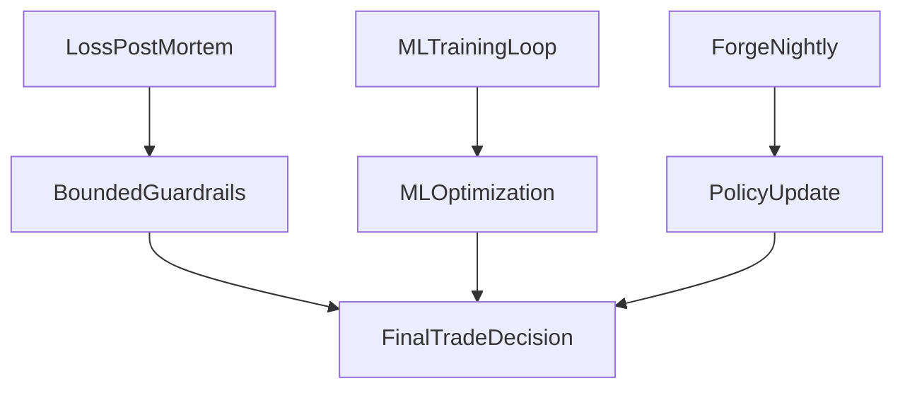

<div align="center">

# VINCE

```
  ██╗   ██╗██╗███╗   ██╗ ██████╗███████╗
  ██║   ██║██║████╗  ██║██╔════╝██╔════╝
  ██║   ██║██║██╔██╗ ██║██║     █████╗
  ╚██╗ ██╔╝██║██║╚██╗██║██║     ██╔══╝
   ╚████╔╝ ██║██║ ╚████║╚██████╗███████╗
    ╚═══╝  ╚═╝╚═╝  ╚═══╝ ╚═════╝╚══════╝
```

### _The machine should always be running._

**The durable edge is not a better opinion. It is a better process.** — [We Built the Machine](https://ikigaistudio.substack.com/p/we-built-the-machine) (Substack)

**Short-term monitoring terminal** — OI, funding rates, L/S ratios, portfolio drift, Mando Minutes news, Hyperliquid tickers. Solus runs the weekly Hypersurface options ritual. Forge self-optimizes overnight on Apple Silicon. Part of a three-layer stack: **VINCE** (hours→weeks), [Dexter](https://github.com/eliza420ai-beep/dexter) (months→years, thesis engine), [AIHF](https://github.com/eliza420ai-beep/ai-hedge-fund) (cycle-scale, 18-analyst second opinion).

> **v2 refactor in progress.** v2 core = four agents: VINCE data, Solus, Otaku, Forge. Six agents are moving to other machines. Run the v2 slim roster today with env flags — no code changes required. See [Agent Roster](#agent-roster).

</div>

---

## The Three-Layer System

Each layer has a distinct time horizon, operational cadence, and job. Understanding which layer answers which question — and how often you run it — is the most important thing about working with this system.

| Layer | Repo | Time horizon | Cadence | Primary job |
|-------|------|-------------|---------|-------------|
| **Layer 1** | **VINCE** (this repo) | Hours → weeks | **Daily** | Monitor the situation. Watch OI, funding, L/S ratios, portfolio drift, Mando Minutes, Hyperliquid tickers. Execute Solus options ritual. Surface signals that require immediate action. Run Forge overnight. |
| **Layer 2** | **[Dexter](https://github.com/eliza420ai-beep/dexter)** | Months → 2–3 years | **Weekly** | Hold the thesis (SOUL.md). Build the two active sleeves (tastytrade + Hyperliquid). Re-underwrite when VINCE surfaces a regime shift. Publish `scorecard.json` and canonical portfolio files. |
| **Layer 3** | **[AIHF](https://github.com/eliza420ai-beep/ai-hedge-fund)** | Cycle-scale | **Monthly / Quarterly** | 18-analyst second opinion. Challenge the thesis. Run conviction scoring. Find the blind spots before they find you. |

### Artifacts that flow between layers

| From | To | Artifact | Purpose |
|------|----|----------|---------|
| Dexter | VINCE | `scorecard.json`, `portfolio_*.json` | Canonical Top100 membership, scoring, sleeve weights. VINCE reads these as ground truth. |
| Dexter | VINCE | `cache_dexter/` | Historical API responses (prices, earnings, insiders, company facts). Reduces API cost; imported into `.elizadb/financialdatasets-cache/` when `VINCE_DEXTER_CACHE_IMPORT=true`. |
| AIHF | VINCE | `portfolio_draft_top100.json`, `portfolio_draft_tastytrade_full.json`, `portfolio_draft_hyperliquid_full.json` | Compare/staging artifacts for the Top100 tab. Show overlap and weight differences vs canonical. Never redefine membership, rank, or scores. |
| VINCE | Dexter | `portfolio_watchlist_candidates.json`, discovery runs | Newly surfaced names (X, filings, broad FD screen). Staging inbox — Dexter promotes into sleeves. |

### Why the split matters

Each layer has a different failure mode:

- **VINCE failure** = missed executions. The thesis is right, the machine is running, but no one is at the terminal when the window opens. Twelve weeks of uncollected Solus premiums. An airdrop T&C window that expired.
- **Dexter failure** = wrong thesis. Monitoring is active but the conviction map is stale.
- **AIHF failure** = blind spots. The thesis and monitoring are both internally consistent but unchallenged.

The three layers are designed to catch each other's failure modes.

---

## Monitor The Situation

This is VINCE's primary job. **VINCE doesn't wait to be asked.** It watches, and when something changes that requires attention, it tells you. Before any trade, before any options ritual, before any Forge run — the terminal reads the situation. One standout: **stock discovery from 17,000+ US tickers** (Financial Datasets) down to a ranked shortlist — screen broadly, enrich only survivors, explain why each name made the list. See [Gem Ticker Discovery — 17k → shortlist](#gem-ticker-discovery--17k--shortlist) below.

**Portfolio state** — three JSON files are the ground truth (see [docs/DEXTER-PORTFOLIO-SYNC.md](docs/DEXTER-PORTFOLIO-SYNC.md)):
- `portfolio_hyperliquid.json` — on-chain positions: weights, drift vs target, margin risk.
- `portfolio_tastytrade.json` — current tastytrade sleeve. VINCE surfaces which regime we're in.
- `portfolio_watchlist.json` — staging pipeline. VINCE flags when a watchlist name crosses a threshold.

Ask **"drift"** or **"dexter drift"** for a paper-vs-Dexter-universe report. Guardrails (leverage caps, PTQG): [docs/GUARDRAILS.md](docs/GUARDRAILS.md).

**Financial Datasets insights + cache (tastytrade/watchlist):**
- Configure Cursor MCP connector for Financial Datasets (OAuth) so chat can pull live fundamentals/news for those sleeves.
- Prewarm historical prices once with `bun run fd:cache:portfolio` (reads `portfolio_tastytrade.json` + `portfolio_watchlist.json`).
- Optional autoprewarm task: set `VINCE_FD_CACHE_PREWARM_ENABLED=true` (with interval/age envs) to keep cache fresh in runtime.
- Cache files live in `.elizadb/financialdatasets-cache/`; reruns are cache hits unless you use `--force`.
- Ask **`cached history <TICKER>`** or **`fd cache <TICKER>`** for cache-first historical stats from local files.
- Setup + details: [docs/FINANCIAL_DATASETS_MCP_CACHE.md](docs/FINANCIAL_DATASETS_MCP_CACHE.md).

**Perps data feed (free-tier APIs)** — VINCE data agent pulls continuously:
- Open interest by asset — rising OI in the direction of the trade is confirmation
- Funding rates — extreme positive = crowded longs, extreme negative = crowded shorts
- Long/short ratios — retail vs institutional divergence
- Liquidation heat maps — where forced exits are clustered
- 24h volume and volatility — unusual activity before Solus writes a strike

**Mando Minutes** — morning news feed. VINCE ingests and flags items that touch the SOUL.md thesis: BTC regime signals, equipment capex, power policy, semiconductor revisions.

**Hyperliquid tickers** — unusual moves in any portfolio ticker get surfaced immediately. Correlation breaks and sector rotations are the first signal a re-underwriting may be needed.

**Leaderboard → Charts tab:** TradingView blocks for BTC/core pairs, **Hyperliquid sleeve** (`portfolio_hyperliquid.json`), **Watchlist** (`portfolio_watchlist.json`), and **Tastytrade** (`portfolio_tastytrade.json`).

### Gem Ticker Discovery — 17k → shortlist — This is where VINCE flexes. [Financial Datasets](https://docs.financialdatasets.ai/market-coverage) covers **17,000+ US public companies** (30+ years, 100% SEC filers). We don’t just rank a hand-picked list: we **screen the broad universe**, enrich only survivors, then rank. Result: a shortlist of names worth tracking, watching, and adding — with clear reasons and a falsifiable loop.

- **Universe modes:** **Sleeve** (tastytrade + watchlist only), **Curated full** (sleeve + peer + expansion JSONs), **US broad** (symbol master from FD or `fd_symbol_master.json` — US exchange–listed for tastytrade tradeability). Set `VINCE_FD_DISCOVERY_UNIVERSE_MODE=us_broad` and (optionally) provide a symbol list; otherwise `VINCE_FD_DISCOVERY_FULL_UNIVERSE=true` uses curated full.
- **Two-stage funnel:** Stage 1: **price-only** coarse screen (min price, min dollar volume, min history) over the full candidate set. Stage 2: **enrich only top N** (fundamentals, filings, earnings, insiders, snapshots). So: 17k → screened → ~1k enriched → ranked shortlist. Bounded concurrency in prewarm; coarse screen and metrics written so the UI can show “X screened → Y enriched → Z ranked.”
- **Gem scoring:** Cohort-relative momentum, sector-relative when available, plus subscores (sleeve-fit, momentum/trend, catalyst/event, valuation/quality, diversification, regime). **Structured explanations** per ticker: Momentum, Quality, Event, Liquidity, Portfolio fit — so the operator sees *why* a name made the list in a fixed, comparable format.
- **Resolvable runs:** Each run writes outcomes-ready history (pick-time fields, `discovery-candidates-history.jsonl`, `discovery-resolved-outcomes.jsonl`) and **discovery-metrics.json** (screened/enriched/ranked counts). Resolution uses FD cached daily bars and nearest-trading-day logic.
- **Stocks tab (Leaderboard):** Decision layer: **Add now** (PromoteNow), **Research next** (ResearchNext), **Avoid**, **Net-new** from the full run. Filters: View (All / Net-new only), Universe (Sleeve / Full). Pipeline line when metrics exist: “X screened → Y enriched → Z ranked.” Calibration, resolved outcomes, false positives, and promotion policy live in a collapsible **Details** section. Output goes to `portfolio_watchlist_candidates.json`; live portfolio files are never auto-edited.
- **Tastytrade alignment:** Candidates can show **tastytrade-style tags** (Earnings catalyst, High liquidity, Sector: Technology, etc.) so the flow blends with our premier execution partner’s preset watchlists (Earnings, Liquid Symbols, Sector Watchlists). Glossary and mapping: [docs/TASTYTRADE_WATCHLIST_GLOSSARY.md](docs/TASTYTRADE_WATCHLIST_GLOSSARY.md).

**Why it matters:** Most systems rank a small, curated set. Here you start from the same **17k+ US universe** FD uses, filter hard, enrich only what passes, then rank. The value is visible in the UI (screened → enriched → ranked) and in the reasons (Momentum / Event / Quality / Liquidity). Same harness idea as Forge: one search surface, fixed evaluation, keep/reject, so the system can improve over time without babysitting.

---

## Agent Roster

Four core agents run always. Six v1 agents are moving to other machines — gate them out with env flags, no code changes required.

### v2 Core — always running

| Agent | Role | What it does |
|-------|------|-------------|
| **VINCE** | CDO | Perps data feed: OI, funding, L/S ratios, liquidations. Portfolio drift across the three JSON files. Mando Minutes ingestion. The eyes of the system. |
| **Solus** | CFO | Weekly Hypersurface options — strike ritual, optimal strike, assignment probability (GBM + ML Brier calibration), tail risk, portfolio copula. Core use case. |
| **Otaku** | COO | On-chain identity (ERC-8004), reputation from Solus Brier scores, x402 skill endpoints. Only agent with a funded wallet. |
| **Forge** | — | MLX AutoResearch. Overnight experiments on Apple Silicon: mutate `policies/trading-policy.yaml` + prompts + ML hyperparameters → evaluate against paper-bot replay → commit winners (ΔComposite ≥ +0.5%), revert losers. Push Telegram summary at 2 AM UTC. Silent by default. |

**v2 slim mode** — run just these four agents:

```bash
ELIZA_ENABLED=false KELLY_ENABLED=false ECHO_ENABLED=false \
SENTINEL_ENABLED=false CLAWTERM_ENABLED=false \
ORACLE_ENABLED=false NAVAL_ENABLED=false bun start
```

### v1 Agents — moving to other machines

Gate each out with `<NAME>_ENABLED=false`. All default to `true` for backward compatibility.

| Agent | v2 destination | To disable |
|-------|---------------|------------|
| **Eliza** | (1) Perplexity Computer research skill + (2) AIHF Substack writing assistant | `ELIZA_ENABLED=false` |
| **Kelly** | OpenClaw / Nemoclaw portable lifestyle skill (runs 24/7 on a daemon) | `KELLY_ENABLED=false` |
| **Echo** | Dexter thesis-layer skill — X alpha feeds conviction, not perps | `ECHO_ENABLED=false` |
| **Sentinel** | Claude Code agent skill | `SENTINEL_ENABLED=false` |
| **Clawterm** | Claude Code agent skill | `CLAWTERM_ENABLED=false` |
| **Oracle** | Stub only — Polymarket never produced real edge | `ORACLE_ENABLED=false` |
| **Naval** | Evaluate → Dexter SOUL.md review layer | `NAVAL_ENABLED=false` |

---

## Forge — Primary Overnight Focus

Forge is VINCE's MLX-powered AutoResearch layer. It runs on Apple Silicon while the rest of the system sleeps and gets smarter without manual steps.

**Composite metric:** `causal_uplift × Sharpe × brier_calibration`

All three must improve together. A threshold change that boosts Sharpe but hurts Solus calibration or causal uplift does not ship. Same proof bar as the rest of the system.

**Mutable surfaces:**
- Phase 1 (live): `policies/trading-policy.yaml`, `prompts/vince-entry-gate.md`, `prompts/solus-strike-ritual.md`
- Phase 2 (≥90 feature-store rows): `train_models.py` hyperparameters, Thompson Sampling priors
- Phase 3 (with human approval): agent `style.all` — Otaku mutations require explicit confirmation

**The nightly loop:**
1. Trigger at `FORGE_NIGHTLY_HOUR_UTC` (default 2 AM UTC)
2. Read `SOUL.md` for investment thesis context — experiments that contradict the thesis get a 0.8× alignment penalty
3. Generate up to `FORGE_MAX_EXPERIMENTS` mutations (default: 10)
4. Run each against paper-bot replay; score on composite metric
5. Safety gate: ΔComposite ≥ +0.5%, drawdown ≤ 15%, win rate ≥ 45%, max leverage ≤ 40, max single trade ≤ $50K
6. Winners → `git commit` on `forge/experiment-YYYYMMDD-NNN`; losers → `git checkout --` revert
7. Push Telegram summary to `#forge` / `#ops` channels

**Forge Ops card (Leaderboard):** In the dashboard **Leaderboard → Markets** tab, a **Forge Ops** card shows deterministic replay gate status (holdout, trigger count, win-rate) and metrics (Sharpe, Brier, cache size) from the signal cache. Branch and policy hash are shown for context. Use it to see at a glance whether promotion gates would pass.

**Harness, not open-ended freedom:** Forge and Gem Ticker Discovery both follow the same principle as [autoresearch-mlx](https://github.com/eliza420ai-beep/autoresearch-mlx) (our Apple Silicon port of Karpathy’s autoresearch): the agent is useful when the *harness* is tight. One mutable surface (policy + prompts vs `train.py`), one metric (composite vs val_bpb), fixed evaluation (replay vs 5‑min run), keep/revert on the score, and explicit failure handling. The impressive part is not that an agent can edit code or rank tickers; it is that the environment makes those edits measurable, discardable, and repeatable without babysitting.

**Promotion gate enforcement:** A shared **hard promotion validator** runs before every winner commit. No experiment is committed unless all gates pass (ΔComposite, win rate, drawdown, leverage, holdout/trigger data). Explicit **reject reasons** are recorded per loser and surfaced in the nightly summary, on-demand run output, and the Forge job ledger (`bun run forge:jobs-tail` shows a `rejectReasons` column when present).

**Low-data remediation:** When holdout or trigger gates fail (e.g. too few labeled outcomes), Forge runs **auto-remediation**: (1) FD cache health check and optional prewarm (`financialdatasets-cache`), (2) paper-bot activity diagnostics from ops summary or runtime, (3) a structured **insufficient-data alert** pushed to rooms named `ops` or `forge`, with fallback to `sentinel`. This runs from the daily report task and from the nightly/on-demand experiment path when the run is skipped for low data.

**Runtime:** MLX on Apple Silicon (300–600 experiments/hour). Falls back to `train_models.py` on CPU when MLX unavailable.

Three improvement loops now run without manual steps:

| Loop | Cadence | Optimizes |
|------|---------|-----------|
| ML loop | Every 12h (90+ closed trades) | Model weights, signal thresholds, TP/SL |
| Strategy genome | Weekly | 15+ algo parameters (Sharpe + drawdown) |
| **Forge** | **Nightly** | **Policy thresholds + prompts + hyperparams** |

```
trades → feature store → [ML loop: train → ONNX → deploy]
                       ↓
          [Forge nightly: mutate policy + prompts → replay → commit winners]
                       ↓
        composite metric improves → both loops compound on each other
```

[Research charter: docs/FORGE_PROGRAM.md](docs/FORGE_PROGRAM.md) · [Agent brief: docs/FORGE.md](docs/FORGE.md)

---

## Three Loops That Never Sleep — What’s Implemented

The architecture in [Three Loops That Never Sleep](https://ikigaistudio.substack.com/p/three-loops-that-never-sleep) is implemented end-to-end. These eight pieces close the gap between the essay and the codebase:

| # | What | Where |
|---|------|--------|
| **1** | **Prompt templates at runtime** | Entry gate and Solus strike ritual load `prompts/vince-entry-gate.md` and `prompts/solus-strike-ritual.md` at invocation (inline fallback if missing). Forge’s prompt mutations affect live behavior. |
| **2** | **Prompt mutations in Forge** | `generatePromptMutations()` and `applyPromptMutation()` in the experiment service; bounded parameter changes in those files are in the nightly experiment pool with policy mutations. |
| **3** | **SOUL.md thesis alignment** | Experiments that contradict the thesis get a 0.8× multiplier on the composite; `thesis_alignment` is stored on results and in the Forge job ledger. |
| **4** | **Causal uplift** | Replay uses a rule-based baseline (equal weights, no ML). Composite uses `causal_uplift = candidate_win_rate - baseline_win_rate` so the metric reflects causation, not correlation. |
| **5** | **Genome composite** | Strategy genome fitness is the same multiplicative composite as Forge: `causal_uplift × Sharpe × (1 − Brier)`. Drawdown and trade count stay as hard gates. |
| **6** | **Guardrails enforced** | `ASSET_CLASS_MAX_LEVERAGE` is enforced in `validateTrade()`; paper-trading and bot action pass asset-class caps; guardrail rejections are logged. |
| **7** | **MLX in the nightly loop** | When `FORGE_USE_MLX=true` and the MLX service is available, the nightly run uses `forgeMlx.runAutoresearch()` for the experiment sweep; otherwise TypeScript replay runs. |
| **8** | **Composite time-series** | After each Forge run, genome evolution, and ML training, a snapshot is appended to `data/forge-composite-history.jsonl`, `data/genome-composite-history.jsonl`, and `data/ml-composite-history.jsonl` for monitoring and charts. |

One composite metric, one precedence order (hard limits → guardrails → policy → ML), and three loops that compound without manual steps.

---

## Solus — Hypersurface Options

Solus handles the weekly onchain options strategy on Hypersurface (BTC, ETH, SOL, HYPE). One ask — "optimal strike for BTC" or "strike ritual" — and you get a strike call with **assignment probability** (GBM closed-form, or ML-calibrated when the ONNX model is trained on resolved predictions).

**Self-calibrating:** every strike call auto-records a prediction; at expiry you resolve it. Brier score over resolved rows measures calibration. That score and the last 10 outcomes are injected into every subsequent prompt — Solus sees its own track record and tempers confidence when it's been wrong. Friday reminder triggers for resolution. At 50+ resolved rows, a recurring task trains an ONNX assignment calibrator and the context switches to ML-calibrated P(assign).

**Tail risk** and **portfolio assignment risk** (Gaussian copula across 2+ positions) are in the same context. TypeScript-only, no extra APIs.

[SOLUS.md](docs/SOLUS.md) · [plugin-solus/FEATURE-STORE.md](src/plugins/plugin-solus/FEATURE-STORE.md) · [IMPROVEMENT_PROOF.md](src/plugins/plugin-solus/IMPROVEMENT_PROOF.md)

---

## Why

The durable edge today is code: repeatable process, broad coverage, zero emotional drift.

Renaissance's Medallion: ~39% annualized since the late 1980s. Berkshire's audited long-run record: ~19.9% annualized in the same period. Medallion won by repeating small statistical edges across many instruments with discipline. Code can monitor thousands of positions, react in milliseconds, and execute the same playbook without fatigue.

Three foundations made this inevitable:
1. **1952** — Markowitz proved portfolio construction could be mathematical.
2. **1964** — Sharpe introduced CAPM: a way to measure and compare risk-adjusted returns.
3. **1973** — Black-Scholes published the options pricing equation — clear inputs, measurable outputs, formulas that adapt with data.

Edward Thorp proved these ideas in live markets. Jim Simons scaled them at Renaissance.

### Five levels of autonomous investing

| Level | Name | Edge |
|:------|:-----|:-----|
| **1** | Manual | Information scarcity. Who you knew, whether you had conviction. |
| **2** | Algorithmic | Pre-defined rules execute automatically. Speed, no learning. |
| **3** | Automated | Integrated workflows: data feeds, portfolio models, execution. Reduced friction. |
| **4** | Autonomous | ML models that update on new data without explicit reprogramming. |
| **5** | Agentic AI | Plans, chooses actions, uses tools, monitors outcomes, self-corrects. |

VINCE v2 targets **Level 5** with a tighter surface: Solus as the weekly options workflow, Forge as the overnight self-improvement engine, Otaku as the on-chain identity layer, the paper bot as the causal proof harness. The loop is the same as v1. The agent count is not.

Goal: stay in the game without living on screens. Push, not pull.

---

## Getting Started

```bash
bun install
cp .env.example .env   # add at minimum OPENAI_API_KEY or ANTHROPIC_API_KEY
bun run build

elizaos dev            # hot-reload
# or
bun start              # production (Postgres when POSTGRES_URL set)
```

**Web UI:** `bun start` serves the API on port 3000 and the frontend on **5173**. Open http://localhost:5173 for chat and the dashboard.

**v2 slim mode** (4-agent core only):

```bash
ELIZA_ENABLED=false KELLY_ENABLED=false ECHO_ENABLED=false \
SENTINEL_ENABLED=false CLAWTERM_ENABLED=false \
ORACLE_ENABLED=false NAVAL_ENABLED=false bun start
```

**Forge config** (in `.env`):

```bash
FORGE_ENABLED=true
FORGE_RUNTIME=mlx              # mlx (Apple Silicon) | python (CPU fallback)
FORGE_BUDGET_MINUTES=120       # default 5-hour safe nightly window
FORGE_NIGHTLY_HOUR_UTC=2       # default 2 AM UTC
FORGE_TELEGRAM_PUSH=true       # push nightly summary to #forge/#ops
```

---

## Paper Bot & ML

The paper bot runs 24/7: 15+ signal sources, 38 onchain assets (crypto, stocks, commodities, indices) as Hyperliquid perps. Every open position shows strength, confidence, sources, and R:R; every close feeds the feature store and ML loop.

Four ONNX models: signal quality, position sizing, TP optimizer, SL optimizer. Rule-based fallbacks keep it running when models are missing. The dashboard's "100 trades processed" is the Weight Bandit (Thompson Sampling) count of **closed** trades; ONNX loads when you run training and place `.onnx` files + `training_metadata.json` in `.elizadb/vince-paper-bot/models/`.

**VinceBench** scores every closed trade on process quality (signal, risk, timing, regime). The score trains the signal-quality model to learn more from high-quality decisions.

### Autopilot loop

```
trades → feature store → [ML loop every 12h: train → ONNX → deploy]
                       ↓
        [Forge nightly: mutate policy + prompts → replay → commit winners]
                       ↓
     composite metric improves → both loops compound on each other
```

1. **Trade** → outcomes written to feature store.
2. **`TRAIN_ONNX_WHEN_READY`** runs every 12h; when there are 90+ complete trades, runs `train_models.py` (at most once per 24h).
3. **New ONNX + `training_metadata.json`** written; on Cloud the task uploads to Supabase and calls `reloadModels()` without restart.
4. **Forge** runs overnight, mutates policy thresholds and prompts, commits winners.
5. Next cycle uses updated thresholds, TP/SL from ONNX, and (if `VINCE_APPLY_IMPROVEMENT_WEIGHTS=true`) updated aggregator weights.

### Paper bot tuning (env)

| Env var | Purpose |
|--------|--------|
| `VINCE_ML_SIGNAL_QUALITY_THRESHOLD` | 0–1. Override ML signal-quality threshold; lower = more trades. |
| `VINCE_SWARM_ENABLED` | `true`/`false`. Enable swarm consensus gating. |
| `VINCE_SWARM_MIN_CONFIDENCE` | 0–1 (default `0.5`). Min swarm consensus to allow a trade. |
| `VINCE_AGGRESSIVE_MARGIN_USD` | Fixed margin per trade in aggressive mode (default `1000`). |
| `VINCE_AGGRESSIVE_BASE_SIZE_PCT` | Base size as % of portfolio when portfolio < margin (default `12`). |
| `VINCE_PAPER_MAX_SINGLE_TRADE_USD` | Paper bucket cap per trade (default `10000`). |

**Single-trade cap:** The paper bucket and policy rule cap each trade at $10K by default. If you see "blocked by policy engine: max-single-trade-usd" in logs, set `VINCE_PAPER_MAX_SINGLE_TRADE_USD` to raise it.

### Re-run training

```bash
bun run train-models -- --bench-score-weight
# or with recency weighting:
bun run train-models:recency
```

Output goes to `.elizadb/vince-paper-bot/models/`. Restart the agent to load the new threshold and `training_metadata.json`. Optionally: `VINCE_APPLY_IMPROVEMENT_WEIGHTS=true bun run improvement-weights` to apply source weight changes from the improvement report.

### Validate ML improvement

```bash
bun run validate-ml
```

Loads feature-store data, computes suggested tuning (Q0.25 of profitable trades), and reports baseline win rate vs filtered win rate.

Full loop: [PAPER-BOT-AND-ML.md](docs/PAPER-BOT-AND-ML.md) · ONNX: [ONNX.md](docs/ONNX.md) · Feature store: [FEATURE-STORE.md](docs/FEATURE-STORE.md)

### ML loop vs post-mortem loop

- **ML loop = performance engine.** Learns from many trades. Predicts better signal quality, size, TP/SL.
- **Post-mortem loop = safety engine.** Learns from losses. Applies bounded guardrails, validates, rolls back if results don't improve.
- **Forge = policy engine.** Searches the threshold/prompt/hyperparameter space nightly. Commits winners as diff-ready branches.

Precedence: hard risk limits → post-mortem guardrails → policy engine → ML optimization inside those limits.



---

## North Star

The north star is not a specific return target. **It is a specific operating state:** the portfolio reflects the thesis at all times, the options premium machine runs weekly without gaps, and the three improvement loops compound overnight without supervision. The human is freed from the mechanical work of executing a plan that is already built.

**On Hyperliquid** — HIP-3 compliant sleeve: concentrated AI winners and financial rails (NVDA, TSM, MSFT, META, AMZN, GOOGL, PLTR, ORCL, COIN, HOOD). Position weights in `portfolio_hyperliquid.json`; drift monitored by VINCE; Solus writes weekly options on Hypersurface for premium income.

**On Tastytrade** — AI infrastructure bottleneck sleeve (ASML, AMAT, KLAC, LRCX, SNPS, CDNS, ANET, AVGO, VRT and extensions). Positions in `portfolio_tastytrade.json`; rebalanced by SOUL.md conviction tiers and regime.

**Division of labor:** The machine monitors. The machine executes. The machine improves overnight. The human holds the thesis, challenges the machine, and writes the record. Weekly and quarterly [Substack](https://ikigaistudio.substack.com) reports are the accountability layer — thesis stated clearly, decisions explained, outcomes accounted for.

---

## Scripts

| Script | Purpose |
|:-------|:--------|
| `elizaos dev` | Hot-reload development |
| `bun start` | Production start (all agents) |
| `bun run deploy:cloud` | Deploy to Eliza Cloud |
| `bun run sync:supabase` | Backfill features to Supabase |
| `bun run db:check` | Verify DB migrations |
| `bun run train-models` | Train ML models (min 90 closed trades) |
| `bun run train-models:recency` | Train with recency decay (upweight recent trades) |
| `bun run improvement-weights` | Apply improvement report source weights |
| `bun run validate-ml` | Validate ML thresholds on feature-store data |
| `bun run fd:cache:portfolio` | Prewarm Financial Datasets historical cache for tastytrade + watchlist sleeves |
| `bun run forge:daily-report` | Write daily Forge markdown report + print Discord-ready summary |
| `bun run forge:push-now` | Ask Forge agent to push daily summary to forge/ops channels immediately |
| `bun run forge:job-status -- <jobId>` | Query async messaging job status/result for Forge command jobs |
| `bun run forge:jobs-tail -- --limit 20` | Tail Forge job ledger from `.elizadb/forge/jobs.jsonl` in table format |
| `bun run type-check` | TypeScript check (no emit) |
| `bun run check-all` | type-check + format + tests |

**v2 slim roster** (4-agent core):
```bash
ELIZA_ENABLED=false KELLY_ENABLED=false ECHO_ENABLED=false \
SENTINEL_ENABLED=false CLAWTERM_ENABLED=false \
ORACLE_ENABLED=false NAVAL_ENABLED=false bun start
```

Forge daily push can run automatically in runtime with:

```bash
FORGE_DAILY_REPORT_ENABLED=true
FORGE_DAILY_REPORT_HOUR_UTC=7
```

Forge async terminal flow (when using jobs fallback):

```bash
# 1) ask Forge to push now
bun run forge:push-now

# 2) copy jobId from output, then inspect status/result
bun run forge:job-status -- <jobId>
```

Async command jobs are also appended to `.elizadb/forge/jobs.jsonl` with:
`command`, `jobId`, `acceptedAt`, `finalStatus`, `resultHash` (when available), and `rejectReasons` (promotion gate failures when the run completed and wrote `last-run.json`).

---

## Docs

| Doc | What |
|:----|:-----|
| [FORGE_PROGRAM.md](docs/FORGE_PROGRAM.md) | Forge research charter — composite metric, mutable surfaces, safety gates, budget |
| [FORGE.md](docs/FORGE.md) | Forge agent brief — can/cannot, key files, next PRDs |
| [SOLUS.md](docs/SOLUS.md) | Solus options agent — Brier calibration, tail risk, copula |
| [FEATURE-STORE.md](docs/FEATURE-STORE.md) | ML feature store schema and usage |
| [PAPER-BOT-AND-ML.md](docs/PAPER-BOT-AND-ML.md) | Signal loop, training, ONNX deployment |
| [ONNX.md](docs/ONNX.md) | Train, export, deploy ONNX models |
| [MULTI_AGENT.md](docs/MULTI_AGENT.md) | ASK_AGENT, standups, Discord |
| [OTAKU.md](docs/OTAKU.md) | Executor agent, DeFi, ERC-8004 identity |
| [DEPLOY.md](docs/DEPLOY.md) | Eliza Cloud, env, troubleshooting |
| [CONFIGURATION.md](docs/CONFIGURATION.md) | Push schedule, Discord, env vars |
| [GUARDRAILS.md](docs/GUARDRAILS.md) | Leverage caps, PTQG/max-loss process, weekly guardrail runbook |
| [FINANCIAL_DATASETS_MCP_CACHE.md](docs/FINANCIAL_DATASETS_MCP_CACHE.md) | Cursor MCP setup + historical cache prewarm workflow |
| [FD-WAREHOUSE.md](docs/FD-WAREHOUSE.md) | Financial Datasets warehouse + Gem Ticker Discovery (V2) |
| [CLAUDE.md](CLAUDE.md) | Dev guide (character, plugins, tests) |
| [DEXTER.md](docs/DEXTER.md) | Dexter integration — SOUL.md, fundamentals, execution gate |
| [AIHF.md](docs/AIHF.md) | AIHF adversarial challenge layer |
| [RECURSIVE.md](docs/RECURSIVE.md) | Autoresearch architecture, signal cache, 5,000+ experiments/night |
| [plugin-vince](src/plugins/plugin-vince/) | WHAT, WHY, HOW, README |
| [We Built the Machine](https://ikigaistudio.substack.com/p/we-built-the-machine) | Full architecture essay — three layers, failure modes, harness, north star |
| [Three Loops That Never Sleep](https://ikigaistudio.substack.com/p/three-loops-that-never-sleep) | Composite metric, ML / genome / Forge loops, precedence order — and [what’s implemented](#three-loops-that-never-sleep--whats-implemented) in this repo |

---

<div align="center">

_Built with [ElizaOS](https://github.com/elizaos/eliza). No hype. No permission. No exit._

</div>
