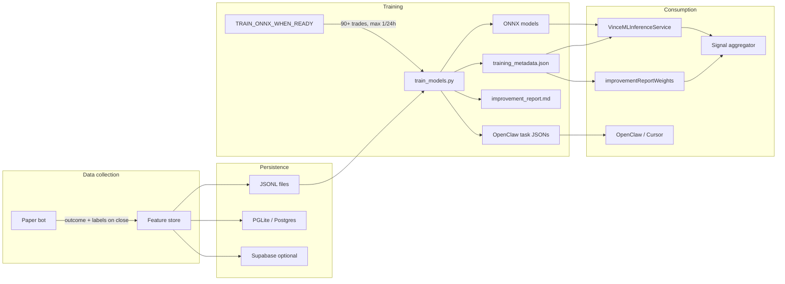

# PRD: VINCE ML Training Pipeline — End-to-End

**Status:** Implemented (V4.x); evolution tracked here  
**Scope:** Feature store → Python training → ONNX export → improvement report → Sentinel tasks → ML inference in paper bot. One source of truth for the pipeline so OpenClaw, Sentinel, and humans can prioritize work.  
**Owner:** Sentinel (ops, cost, ONNX) and plugin-vince (training script, feature store).  
**Related:** [FEATURE-STORE.md](../../FEATURE-STORE.md), [scripts/README.md](../../../src/plugins/plugin-vince/scripts/README.md), [PARAMETER_IMPROVEMENT.md](../../../src/plugins/plugin-vince/scripts/PARAMETER_IMPROVEMENT.md), [PAPER-BOT-AND-ML.md](../../PAPER-BOT-AND-ML.md).

---

## 1. Problem and goal (plain English)

**Problem:** The paper bot makes 40+ features per decision; training turns that into four ONNX models (signal quality, position sizing, TP optimizer, SL optimizer). Without a single doc, it's unclear how data flows from trades to models, how the improvement report turns into action, and where the pipeline can break or be improved.

**Goal:** One PRD that describes the **entire ML training pipeline**: where data lives, how training is triggered, what the improvement report contains, how it feeds Sentinel and the inference service, and what "good" looks like. Use it to onboard, to brief OpenClaw/Sentinel, and to decide what to build next.

---

## 2. Architecture and data flow

**Flow in words:**

1. **Collect:** Paper bot opens/closes trades; feature store writes one record per decision (with `outcome` and `labels` on close).
2. **Persist:** Records go to local JSONL, PGLite/Postgres (when DB is used), and optionally Supabase for 500+ row queries.
3. **Train:** Task `TRAIN_ONNX_WHEN_READY` runs on a schedule (e.g. 12h); if complete count ≥ 90 and cooldown allows (or recent win rate < 45%), it runs `train_models.py` on the feature directory. Script loads JSONL, trains four XGBoost models, exports ONNX, writes `training_metadata.json` and `improvement_report.md`, and may create Sentinel task briefs in `docs/standup/openclaw-queue/`.
4. **Consume:** ML Inference Service loads ONNX and metadata from `.elizadb/vince-paper-bot/models/` (or Supabase bucket on Cloud); signal aggregator uses ML scores and optional suggested threshold from metadata; improvement-report weights (when enabled) nudge source weights from feature importances.
5. **Act:** OpenClaw (or human) consumes queue tasks (e.g. "Add X to feature store", "Tighten TP level 2 rules").

---

## 3. Components in detail

### 3.1 Feature store (input to training)

- **Source:** [vinceFeatureStore.service.ts](../../../src/plugins/plugin-vince/src/services/vinceFeatureStore.service.ts). Paper bot appends records on open and on close (with outcome/labels).
- **Shape:** Nested sections: `market`, `session`, `signal`, `regime`, `news`, `execution`, `outcome`, `labels`. Optional: `avoided` (no-trade evaluations), `wtt` (What's the Trade ordinals), `decisionDrivers`.
- **Training filter:** Only rows with `outcome` and `labels` (closed trades) are used; `avoided` rows are stored for future use (e.g. avoid-classifier) but skipped by current training.
- **Paths:** Default dir `.elizadb/vince-paper-bot/features/`; files `features_*.jsonl`, `combined.jsonl`. See [FEATURE-STORE.md](../../FEATURE-STORE.md).

### 3.2 Training trigger (TRAIN_ONNX_WHEN_READY)

- **Source:** [trainOnnx.tasks.ts](../../../src/plugins/plugin-vince/src/tasks/trainOnnx.tasks.ts).
- **Conditions:** Feature store `getCompleteRecordCount(365)` ≥ 90; last training > 24h ago, **or** recent 50-trade win rate < 45% (bypass cooldown).
- **Action:** Spawns `python3 train_models.py --data <features_dir> --output <models_dir> --min-samples 90`. On Cloud, after success: uploads ONNX + metadata to Supabase bucket `vince-ml-models`, then calls `VinceMLInferenceService.reloadModels()` so new models apply without redeploy.
- **Schedule:** Recurring task every 12h (configurable via task metadata).

### 3.3 train_models.py (core script)

- **Path:** [train_models.py](../../../src/plugins/plugin-vince/scripts/train_models.py).
- **Input:** Directory of JSONL (or single file); only records with `outcome` and `labels`.
- **Models:** Four XGBoost-based models: signal_quality (binary), position_sizing (regression), tp_optimizer (multi-class), sl_optimizer (quantile). Feature prep: flatten nested keys to `section_key`, add lag features, asset dummies, optional VinceBench weighting.
- **Flags (summary):** `--model {all|signal_quality|position_sizing|tp_optimizer|sl_optimizer}`, `--min-samples`, `--recency-decay` (default 0.01), `--balance-assets` (default on), `--bench-only`, `--tune-hyperparams`, `--parallel`. Pre-flight: trade count + worst empty columns; exit with message if below min-samples. Auto-keep-last-good-model: compare new vs existing on holdout; if new is worse, do not overwrite ONNX.
- **Outputs:**
  - ONNX files: `signal_quality.onnx`, `position_sizing.onnx`, `tp_optimizer.onnx`, `sl_optimizer.onnx`.
  - `training_metadata.json`: model hashes, feature names per model, `improvement_report` (see below), Platt params for signal quality.
  - `improvement_report.md`: human-readable report.
  - Per-model `*_features.json` (feature name manifest).
  - Optional joblib backups.
- **Improvement report contents (in metadata and .md):** feature_importances per model, holdout_metrics (AUC/MAE/quantile), suggested_signal_quality_threshold, tp_level_performance (win rate/count per level), decision_drivers_by_direction, suggested_signal_factors (missing or mostly-null factors), action_items, wtt_performance (when WTT data present). Footer: "Sentinel tasks: Created N…" or "No action needed."

### 3.4 Sentinel task creation from report

- **Source:** `_create_sentinel_tasks_from_report()` in [train_models.py](../../../src/plugins/plugin-vince/scripts/train_models.py); called after `build_improvement_report()`.
- **Contract:** [OPENCLAW_TASK_CONTRACT.md](../OPENCLAW_TASK_CONTRACT.md). Tasks written to `docs/standup/openclaw-queue/` (or `STANDUP_DELIVERABLES_DIR/openclaw-queue/`) as `YYYY-MM-DD-ml-<slug>.json`.
- **Heuristics:** (1) TP level with win_rate < 45% and count ≥ 3 → "Tighten TP level N rules". (2) Each suggested_signal_factor → "Add <name> to feature store". (3) If suggested_signal_quality_threshold present → "Review ML signalQualityThreshold from improvement report".
- **Fields:** id, title, description, scope, acceptanceCriteria, expectedOutcome, source (`ml_training`), branchName, createdAt, optional plugin/priority/effort.

### 3.5 ML Inference Service (runtime consumption)

- **Source:** [mlInference.service.ts](../../../src/plugins/plugin-vince/src/services/mlInference.service.ts).
- **Load path:** Reads `.elizadb/vince-paper-bot/models/` (or on Cloud, download from Supabase bucket if local empty). Loads ONNX + `training_metadata.json`. Builds feature vector from `training_metadata.signal_quality_feature_names` when present (avoids dimension mismatch after retrains).
- **Fallback:** When ONNX missing or inference fails: uses rule-based thresholds; `getSignalQualityThreshold()` returns `improvement_report.suggested_signal_quality_threshold` from metadata when present.
- **Reload:** `reloadModels()` called by TRAIN_ONNX_WHEN_READY after upload on Cloud so new models apply without restart.

### 3.6 Improvement report weights (optional)

- **Source:** [improvementReportWeights.ts](../../../src/plugins/plugin-vince/src/utils/improvementReportWeights.ts). Reads `training_metadata.json` (feature_importances.signal_quality, suggested_signal_factors), maps features to source names, and when `VINCE_APPLY_IMPROVEMENT_WEIGHTS=true` nudges dynamicConfig source weights (e.g. 0.5–2.0) so weights stay data-driven after retrains.

### 3.7 Signal aggregator integration

- **Source:** [signalAggregator.service.ts](../../../src/plugins/plugin-vince/src/services/signalAggregator.service.ts). Uses ML inference for signal quality score and optional min-quality threshold from metadata; applies position sizing and TP/SL suggestions from ONNX when models and inputs are available.

---

## 4. Success criteria (current system)

- **Data:** Feature store has 90+ complete trades; JSONL (and optionally Supabase) is the single source for training.
- **Training:** TRAIN_ONNX_WHEN_READY runs at most once per 24h (or bypass when recent win rate < 45%); train_models.py completes without crash; ONNX + metadata written; if new model worse on holdout, previous ONNX kept.
- **Report:** improvement_report.md and training_metadata.improvement_report contain feature importances, holdout metrics, suggested threshold, TP performance, action items; report footer states Sentinel tasks created or "No action needed."
- **Consumption:** ML Inference Service loads models and metadata; aggregator uses ML scores and suggested threshold when present; improvement-report weights (if enabled) apply after each train.
- **Tasks:** Sentinel/OpenClaw queue receives 0–N task JSONs per run; consumers create branches and PRs from task briefs (no push to main).

---

## 5. Acceptance criteria (for changes)

- Any change to the pipeline: (1) does not break existing "90+ trades → train → ONNX + report" path; (2) keeps or extends the improvement report and Sentinel task contract; (3) preserves backward compatibility of training_metadata.json shape consumed by mlInference and improvementReportWeights; (4) adds zero new runtime dependencies for the Node side (Python deps only in scripts/requirements.txt).
- New flags or defaults in train_models.py must be documented in [scripts/README.md](../../../src/plugins/plugin-vince/scripts/README.md) and, if user-facing, in [PAPER-BOT-AND-ML.md](../../PAPER-BOT-AND-ML.md).

---

## 6. Out of scope (this PRD)

- **Feature store evolution** (Supabase rollout, avoided-record training, new columns): see [FEATURE-STORE.md](../../FEATURE-STORE.md) and a separate Feature Store PRD if needed.
- **Strategy genome / parameter mutation:** Separate system (vinceGenome, genomeEvolution tasks); genome replays against feature store but does not replace ONNX training.
- **Live execution:** Pipeline serves paper bot and readiness checks; execution graduation and real-money execution are out of scope here.
- **New model types or ensembles:** Backlog items (e.g. signal_quality → position_sizing chaining, avoid-classifier) are future work.

---

## 7. Rollback and failure modes

- **Rollback:** Revert train_models.py or task changes; keep existing ONNX and metadata in place. Old .joblib backups in output dir are not overwritten when "keep last good" skips deploy.
- **Failure modes:** (1) < 90 trades → task skips; pre-flight in script exits with message. (2) Python or deps missing in container → training fails; task logs stderr; cooldown not updated so next run retries. (3) Supabase upload fails → models remain local; reloadModels() still loads from local. (4) Column mismatch (e.g. new feature in store not in train_models) → fix feature prep or inference mapping per [FEATURE-STORE.md](../../FEATURE-STORE.md) § Feature name mapping.

---

## 8. Deployment and environment

- **Local:** venv, `pip install -r src/plugins/plugin-vince/scripts/requirements.txt`, macOS `brew install libomp`. Run script manually or rely on task when app is running.
- **Eliza Cloud:** Dockerfile installs Python and script deps; task runs in container; models uploaded to Supabase Storage bucket `vince-ml-models`; on next startup app downloads models if local dir empty. One-time: create bucket, run [supabase-feature-store-bootstrap.sql](../../../scripts/supabase-feature-store-bootstrap.sql) if using Supabase for features. See [DEPLOY.md](../../DEPLOY.md).

---

## 9. Future phases / backlog

- **Pipeline:** Ensemble (signal_quality prob → position_sizing input); backtest harness (holdout Sharpe, max DD); A/B shadow mode (log ML vs actual); feature selection (RFE + TimeSeriesSplit); optional distributed training for large datasets.
- **Report:** Stricter acceptance criteria for "good" report (e.g. min holdout AUC); optional validation gate that blocks deploy if metrics below threshold.
- **Sentinel:** Auto-consume queue (e.g. Sentinel task that picks next openclaw-queue task and opens PR); priority/effort from report heuristics.
- **Feature store:** Train on avoided records (avoid-classifier); counterfactual use of avoided rows; more suggested factors surfaced and turned into tasks.

---

## 10. References

| Doc | Purpose |
| --- | --- |
| [FEATURE-STORE.md](../../FEATURE-STORE.md) | Storage, 90+ trades, VinceBench, avoided, Supabase, feature name mapping |
| [scripts/README.md](../../../src/plugins/plugin-vince/scripts/README.md) | train_models flags, running, testing, CI |
| [PARAMETER_IMPROVEMENT.md](../../../src/plugins/plugin-vince/scripts/PARAMETER_IMPROVEMENT.md) | How improvement report identifies parameters to improve |
| [PAPER-BOT-AND-ML.md](../../PAPER-BOT-AND-ML.md) | Paper bot + ML overview, safety rules, deploy |
| [OPENCLAW_TASK_CONTRACT.md](../OPENCLAW_TASK_CONTRACT.md) | Task JSON schema, queue dir, consumer contract |
| [DEPLOY.md](../../DEPLOY.md) | Cloud deploy, Supabase bucket, env |

---

**One-line summary:** The ML training pipeline takes closed-trade feature-store data, runs train_models.py when 90+ trades exist (max once per 24h), produces ONNX and an improvement report that drives thresholds and Sentinel tasks, and deploys models into the paper bot without redeploy on Cloud.
