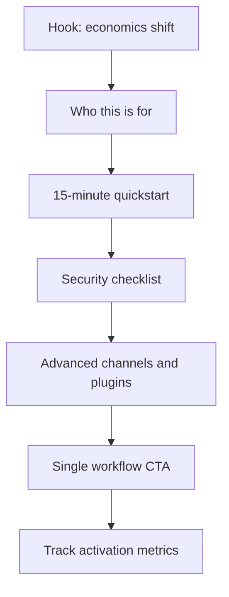

# PRD: OpenClaw + MiniMax Content Engine

**Status:** Draft  
**Scope:** Turn the current long-form draft into a high-trust, conversion-oriented content system that attracts qualified builders, avoids overclaiming risk, and drives measurable setup/activation outcomes.

---

## 1. Goal

Ship a credible, high-performing content package about OpenClaw + MiniMax that:

- explains why the economics matter now,
- helps first-time users successfully set up,
- converts attention into measurable onboarding actions,
- and protects brand trust with strict claims and security guardrails.

---

## 2. Problem

The current draft has strong energy and useful detail, but it is not production-safe yet:

- too long and dense for most distribution channels,
- includes high-risk absolute claims that may not be independently verifiable,
- mixes beginner and advanced setup paths without clear flow,
- delays critical security framing,
- and lacks explicit measurement/rollout ownership.

Without a PRD-backed execution plan, this can underperform on conversion and expose credibility/compliance risk.

---

## 3. Audience and JTBD

### 3.1 Primary audience

- Solo operators, indie founders, and technical professionals who want always-on personal agent workflows.
- Crypto-native and automation-curious users already active on X/Telegram.

### 3.2 Secondary audience

- Engineering managers and operators evaluating internal assistant workflows.
- Non-expert users with high motivation but low command-line confidence.

### 3.3 Jobs-to-be-done

- "Help me understand whether this is worth running 24/7."
- "Give me a setup path I can complete in one sitting."
- "Tell me what can go wrong and how to avoid it."
- "Show me proof this is not just hype."

---

## 4. Positioning and Messaging

### 4.1 Core positioning

OpenClaw + MiniMax is a practical always-on agent stack: strong coding/research capability, fast response speed, and lower operating cost that improves 24/7 viability.

### 4.2 Message pillars

- **Economics:** lower blended cost changes feasibility of continuous operation.
- **Practical setup:** clear path from zero to first live workflow.
- **Operational utility:** the system can act across messaging channels and tools.
- **Security reality:** setup must include hard guardrails from day one.

### 4.3 Red-line language policy

- No "best," "fastest," "rival X" statements without dated evidence.
- No universal claims from anecdotal tests.
- No implied security guarantees; use risk-aware language.

---

## 5. Content System (Deliverables)

### 5.1 Hero asset

- One flagship long-form article (1,200-1,800 words).
- Structure:
  1) Why now (economics + speed)
  2) Who this is for
  3) 15-minute quickstart
  4) Security checklist
  5) Advanced setup options
  6) Costs and expected outcomes
  7) Sources

### 5.2 Derivative assets

- One X thread (10-14 posts).
- One short "first-run checklist" artifact (single-screen, copy/paste friendly).
- One "common setup failures" post (endpoint mismatch, auth mismatch, channel config issues).

### 5.3 Channel-format constraints

- Hero article: depth and trust.
- Thread: hook + proof + CTA.
- Checklist: zero-friction onboarding utility.

---

## 6. Claims, Evidence, and Compliance Guardrails

### 6.1 Claim categories

- **Hard facts:** release versions, URLs, feature availability, config flags.
- **Comparative performance claims:** must be framed as scoped observations.
- **Cost claims:** include assumptions and "as of date" qualifiers.
- **Security claims:** include known risks and mitigation steps.

### 6.2 Evidence policy

- Every numerical claim must have:
  - source link,
  - measurement date,
  - context assumptions.
- For subjective performance claims, require:
  - "in my testing" language,
  - task class examples,
  - explicit non-universality qualifier.

### 6.3 Security framing requirements

Security section must appear before advanced plugins and include:

- never expose agent port publicly,
- network access hardening approach,
- plugin/skill audit expectation,
- patch/update policy and minimum supported version guidance.

---

## 7. Product Narrative Flow (Reader Journey)

---

## 8. Distribution and Measurement

### 8.1 Distribution plan

- **Owned:** primary article destination + docs mirror.
- **Social:** X thread linking to hero asset + checklist.
- **Community:** targeted repost into relevant builder/operator channels.

### 8.2 Funnel metrics

- **Top:** impressions, CTR to hero asset.
- **Middle:** average read depth, checklist click-through.
- **Bottom:** setup-start rate, setup-complete rate, first-action success rate.

### 8.3 Initial target ranges (first 14 days)

- CTR from social to hero asset: >= 2.5%
- Read depth (>= 60% article scroll): >= 35%
- Setup-start conversion from hero asset: >= 8%
- Setup-complete from setup-start: >= 45%
- First workflow success after setup-complete: >= 60%

### 8.4 Instrumentation requirements

- UTM links per channel/variant.
- Distinct CTA links for hero/thread/checklist.
- Single source dashboard for weekly review.

---

## 9. Rollout Plan

### Phase A: Editorial hardening (Day 0-2)

- cut length and tighten structure,
- apply claims guardrails,
- insert security early,
- produce final hero draft.

### Phase B: Derivatives and QA (Day 2-4)

- thread + checklist created,
- source/fact pass complete,
- novice run-through test performed.

### Phase C: Launch and optimize (Day 5+)

- publish hero + thread + checklist,
- monitor daily metrics,
- iterate on first 7-day conversion bottleneck.

---

## 10. Ownership

- **Content owner:** primary drafter/editor.
- **Technical verifier:** validates setup commands and endpoint guidance.
- **Security reviewer:** validates risk language and mitigation checklist.
- **Distribution owner:** schedules launch and tracks funnel performance.

---

## 11. Risks and Mitigations

| Risk | Mitigation |
|------|------------|
| Overclaiming undermines trust | Claims policy with required citations and qualifiers |
| Novice drop-off during setup | 15-minute path first; advanced path separated |
| Security backlash | Early explicit risk section and hardening checklist |
| Good reach, weak conversion | Checklist artifact + single clear CTA + funnel instrumentation |
| Fast-moving external ecosystem | Date-stamp claims and add quarterly content refresh |

---

## 12. Non-Goals

- Not building or shipping new OpenClaw product features.
- Not publishing an exhaustive ecosystem encyclopedia.
- Not guaranteeing universal model parity outcomes across all workloads.

---

## 13. Launch Checklist

- [ ] Hero article under 1,800 words with clear section hierarchy
- [ ] All numerical claims cited with "as-of" date
- [ ] Security section appears before advanced plugin section
- [ ] Thread and checklist finalized and linked
- [ ] UTM structure and analytics dashboard active
- [ ] One novice setup dry run completed end-to-end

---

## 14. Success Criteria

- Asset is publish-ready and evidence-safe without additional strategic rewrites.
- Reader can complete first setup path with minimal ambiguity.
- Team can evaluate content performance weekly using defined funnel metrics.
- Messaging remains confident while preserving factual integrity.

