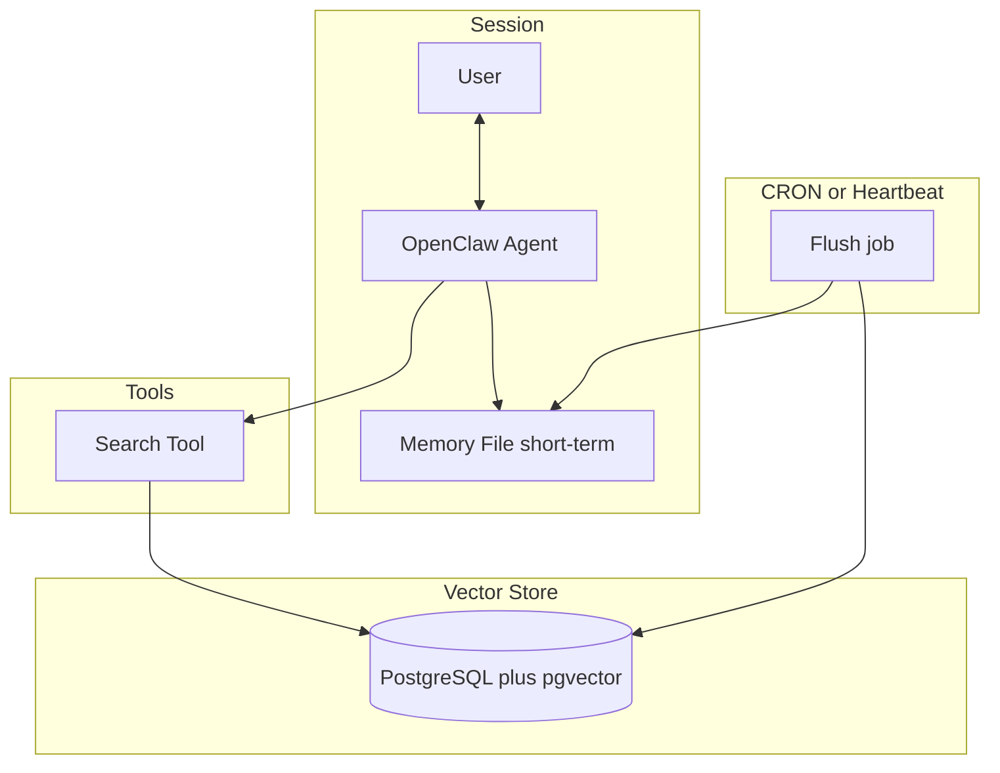

# PRD: OpenClaw RAG Memory

**Status:** Draft  
**Scope:** Solve OpenClaw memory/forgetting via RAG: vector store (PostgreSQL + pgvector), agent-facing search tool, and memory CRON/heartbeat so sessions stay lean and retrieval does the heavy lifting.

---

## 1. Goal

Enable OpenClaw to **remember reliably and stay smart without bloating context**: store memories in PostgreSQL + pgvector, expose a **search tool** the agent invokes to store and retrieve, and **flush short-term file memory** on a schedule so every session starts lean and retrieves on demand.

---

## 2. Problem

The undisputed **#1 reason** agents "forget" and act stupid is **context bloat**, not model token limits. Large context windows (millions of tokens) do not fix this; they often make it worse. The fix is to keep context small and **retrieve only what is needed** when it is needed.

---

## 3. Current State

- **OpenClaw today:** Memory is file-based: `workspace/MEMORY.md` and `workspace/memory/` (daily logs). [Heartbeat](openclaw-agents/heartbeat/HEARTBEAT_PROMPT.md) defines curation rhythm and session hygiene; [Nerves](openclaw-agents/nerves/NERVES_PROMPT.md) handles context efficiency and token audit. There is **no vector store** and **no semantic search**.
- **VINCE/ElizaOS:** Uses PGLite/Postgres + embeddings for RAG; OpenClaw is a separate runtime. Integration is via [openclaw-adapter](knowledge/sentinel-docs/OPENCLAW_ADAPTER.md) and workspace sync (`openclaw-agents/workspace/` ↔ `knowledge/teammate/`).
- **External reference:** Optional third-party memory (e.g. [Honcho](https://docs.honcho.dev)) is noted in [beyond-markdown-ai-native-memory](knowledge/internal-docs/beyond-markdown-ai-native-memory.md); this PRD specifies a self-hosted, RAG-based approach.

---

## 4. Solution (Three Pillars)

### 4.1 PostgreSQL + pgvector

- Run PostgreSQL with the **pgvector** extension on the same host (e.g. Hetzner) or a dedicated DB.
- Store per memory: **label** (short descriptor for retrieval), **embedding** (vector), **raw text**, and optional metadata (e.g. `created_at`, source).

### 4.2 Search tool

- **Create a search tool** the agent can call.
- **On "remember something":** Agent labels the memory, the tool creates an embedding from the label (and/or raw text), and stores label + vector + raw text in the database.
- **On "don't know" / start of task:** The **first** thing the agent should do is **use the search tool** to retrieve relevant memories, then answer using that context. Session context stays minimal; retrieval augments it.

### 4.3 Memory CRON / heartbeat

- **Short-term memory:** The agent continues to write to a **memory file** on-the-go during the session (current behavior).
- **Scheduled flush:** On a CRON or heartbeat (e.g. hourly or daily), a job **reads** the short-term memory file, **chunks/embeds** content, **inserts** into PostgreSQL+pgvector, then **truncates or archives** the file.
- **New sessions:** Load **minimal context** — primarily the **description of the search tool** and the instruction: *"Use the search tool to load relevant memory before answering when you don't know or when the task benefits from past context."*

---

## 5. Architecture

- **Session:** Agent reads/writes short-term memory file; agent calls search tool to store or query memories.
- **Search tool:** On store → embed (label/text) and insert into DB; on query → vector search and return top-k to agent.
- **CRON/Heartbeat:** Reads memory file → embed chunks → insert into DB → archive/clear file. Session init loads only search-tool description + minimal identity.

---

## 6. Scope (Phased)

### Phase 1 – PostgreSQL + pgvector

- Install PostgreSQL and pgvector extension (e.g. on Hetzner or dedicated host).
- Define schema: table with at least `id`, `label`, `embedding` (vector), `raw_text`, `created_at`, optional `metadata`.
- Document connection string and env (e.g. `OPENCLAW_MEMORY_POSTGRES_URL`).

### Phase 2 – Search tool

- Implement **search tool** (create + query): (1) **Store:** accept label + raw text (and optional metadata), generate embedding, insert into DB. (2) **Query:** accept natural-language or label query, embed query, vector search, return top-k results (label + raw_text or snippet).
- Update agent prompt/instructions: "When asked to remember something, use the search tool to store it (label + text). When you don't know something or at task start, use the search tool first to load relevant memory, then respond."

### Phase 3 – Memory file + CRON/heartbeat

- Define **short-term memory file format** (e.g. append-only log or structured lines) and location (e.g. `workspace/memory/shortterm.md` or under `~/.openclaw/`).
- Implement **flush job:** read file, optionally chunk, embed each chunk, insert into DB, then archive/truncate file. Job must be **idempotent** and **configurable** (schedule, file path).
- Wire to CRON or existing heartbeat so it runs on schedule.

### Phase 4 (optional) – n8n / API proxy

- Per the idea: for professional use, consider **n8n** (or similar) for API proxies and security in front of OpenClaw/tools. Out of scope for minimal RAG memory; document as recommended addition.

---

## 7. Non-Goals

- **Not replacing** OpenClaw's file-based workspace for non-memory files (AGENTS.md, TOOLS.md, SOUL.md, etc.).
- **Not changing** Heartbeat/Nerves prompts beyond adding instructions to "use RAG memory" and "flush short-term to DB" where relevant.
- **Not mandating** Honcho or any paid third-party memory service; this PRD is self-hosted RAG.

---

## 8. Risks and Mitigations

| Risk | Mitigation |
|------|------------|
| DB dependency / outage | Health check for DB; fallback to file-only mode when DB unavailable; document recovery. |
| Embedding cost / rate limits | Batch flush job; optional limits on store rate; use a single embedding model (e.g. OpenAI or local). |
| Operator complexity | Clear docs; optional one-click or script for PostgreSQL+pgvector setup (e.g. Docker or Hetzner image). |
| CRON timing / duplicate flush | Configurable schedule; idempotent flush (e.g. process only since last flush timestamp); archive before clear. |

---

## 9. Success Criteria

- Agent **consistently uses the search tool** before answering when it does not know or when the task benefits from past context.
- Short-term memory file is **flushed on schedule** (no unbounded growth).
- **New-session context** stays under a defined token budget (e.g. search-tool description + minimal identity only).
- Operator can say "remember X" and later ask about X and **get X back** via search (stored and retrieved through the tool).

---

## 10. Upsides and Downsides

**Upsides**

- Much better memory and recall.
- Much smarter behavior (retrieval augments every session).
- Much less token-greedy (lean context, retrieve on demand).

**Downsides**

- More moving parts (PostgreSQL, pgvector, flush job, tool).
- Harder for non-devs (setup, maintenance).
- Ongoing maintenance (backups, schema upgrades, embedding model changes).

**Recommended base stack for professional use**

- OpenClaw
- PostgreSQL + pgvector
- n8n (for API proxies / security)

---

## 11. References

- [openclaw-agents/ARCHITECTURE.md](../../openclaw-agents/ARCHITECTURE.md) — Workspace files (MEMORY.md, memory/), Heartbeat, Nerves.
- [openclaw-agents/heartbeat/HEARTBEAT_PROMPT.md](../../openclaw-agents/heartbeat/HEARTBEAT_PROMPT.md) — Memory curation, session hygiene, file size limits.
- [openclaw-agents/nerves/NERVES_PROMPT.md](../../openclaw-agents/nerves/NERVES_PROMPT.md) — Context efficiency, token audit.
- [knowledge/sentinel-docs/PRD_AND_MILAIDY_OPENCLAW.md](../../knowledge/sentinel-docs/PRD_AND_MILAIDY_OPENCLAW.md) — OpenClaw instructions and PRD index.
- [docs/OPENCLAW_VISION.md](../OPENCLAW_VISION.md) — OpenClaw vision and lore.
- [knowledge/internal-docs/beyond-markdown-ai-native-memory.md](../../knowledge/internal-docs/beyond-markdown-ai-native-memory.md) — External memory options (e.g. Honcho).
