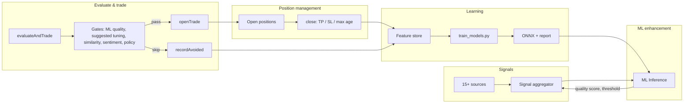

# PRD: Paper Trading Algo — How It Works and How ML Improves It

**Status:** Implemented (V4.x); evolution tracked here  
**Scope:** End-to-end paper trading algorithm: signal sources → aggregation → evaluation gates → open/skip → position management → close → feature store, and how the ML pipeline (ONNX, improvement report, Sentinel tasks) makes the algo better over time.  
**Owner:** Plugin-vince (paper trading, signal aggregator, feature store); Sentinel (ops, cost, ONNX).  
**Related:** [PAPER-BOT-AND-ML.md](../../PAPER-BOT-AND-ML.md), [PRD_ML_TRAINING_PIPELINE.md](./PRD_ML_TRAINING_PIPELINE.md), [FEATURE-STORE.md](../../FEATURE-STORE.md), [PARAMETER_IMPROVEMENT.md](../../../src/plugins/plugin-vince/scripts/PARAMETER_IMPROVEMENT.md).

---

## 1. Problem and goal (plain English)

**Problem:** The paper bot is the core of VINCE: it turns 15+ signal sources into open/skip decisions, sizes positions, manages TP/SL, and records every decision for learning. Without one doc, it’s unclear how the algo flows from “signal” to “trade” to “better algo,” and where ML plugs in.

**Goal:** One PRD that describes the **paper trading algorithm** end-to-end and **how the ML setup improves it**: where signals come from, how they’re aggregated and gated, when we open vs skip, how position management works, and how the feature store + training + ONNX + improvement report close the loop so the algo gets better over time.

---

## 2. The loop at a glance

**In one sentence:** Signals are aggregated and scored by ML; gates (quality, suggested tuning, similarity, sentiment, policy) decide open vs skip; open trades are managed to TP/SL/max age; every decision is stored; training turns history into better ONNX and reports that tighten gates and sizing so the algo improves.

---

## 3. Where the algo lives

| Layer | Where | Purpose |
| ----- | ----- | ------- |
| **Signal sources** | 18+ data-source services, 7 fallbacks | CoinGlass, Binance, MarketRegime, News, X sentiment, Deribit, liquidations, Sanbase, Hyperliquid OI/funding, etc. See [SIGNAL_SOURCES.md](../../../src/plugins/plugin-vince/SIGNAL_SOURCES.md). |
| **Aggregation** | [signalAggregator.service.ts](../../../src/plugins/plugin-vince/src/services/signalAggregator.service.ts) | Weights, thresholds, ML quality prediction, similarity prediction; outputs direction, strength, confidence, factors, mlQualityScore. |
| **Paper trading** | [vincePaperTrading.service.ts](../../../src/plugins/plugin-vince/src/services/vincePaperTrading.service.ts) | `evaluateAndTrade()`: per-asset signal → gates → open or avoid; `openTrade()`, `closeTrade()`; WTT pick evaluation; feature store write. |
| **Position management** | [vincePositionManager.service.ts](../../../src/plugins/plugin-vince/src/services/vincePositionManager.service.ts) | Open positions, TP/SL/max-age exit logic, portfolio state. |
| **Risk** | [vinceRiskManager.service.ts](../../../src/plugins/plugin-vince/src/services/vinceRiskManager.service.ts) | Daily loss limit, drawdown, correlation; validates before open. |
| **Feature store** | [vinceFeatureStore.service.ts](../../../src/plugins/plugin-vince/src/services/vinceFeatureStore.service.ts) | One record per decision (open + outcome/labels on close, or avoided); JSONL + optional PGLite/Supabase. |
| **ML inference** | [mlInference.service.ts](../../../src/plugins/plugin-vince/src/services/mlInference.service.ts) | Signal quality, position sizing, TP/SL suggestions from ONNX; suggested threshold and min strength/confidence from training_metadata. |

---

## 4. Decision flow: from signal to open or skip

**Entry point:** Recurring task (or manual trigger) calls `VincePaperTradingService.evaluateAndTrade()`.

### 4.1 Per asset

1. **Skip if** already have an open position or pending entry for that asset.
2. **Get aggregated signal** for the asset: `signalAggregator.getSignal(asset)`.  
   Aggregation already:
   - Combines 15+ sources with weights (from dynamicConfig; optionally nudged by improvement-report weights).
   - Calls ML Inference to get **signal quality score** (ONNX); applies boost/penalty to confidence; sets `mlQualityScore` and uses **suggested threshold** from training_metadata when present.
   - Optionally runs **similarity** model (avoid/skip when similar past trades lost).
3. **Gates (in order)** — if any gate fails, we skip and optionally record an **avoided** decision:
   - **HIP-3 news guardrail** (non-core assets): if NewsSentiment is driving and asset-specific news is weak/neutral, skip.
   - **ML quality gate** (core assets only): if `mlQualityScore < getSignalQualityThreshold()` (from improvement report or default), skip. Reduces low-quality trades.
   - **Suggested tuning gate** (when not in aggressive mode): if `strength < getSuggestedMinStrength()` or `confidence < getSuggestedMinConfidence()` (from training_metadata.improvement_report.suggested_tuning), skip. Report is produced by train_models from 25th percentile of profitable trades.
   - **Similarity gate** (core assets): if similarity model says “avoid,” skip.
   - **Sentiment gate**: Echo/Oracle sentiment can block or reduce size (skip longs/shorts, apply size multiplier).
   - **Session / open window**: session filters and open-window boost (multipliers).
   - **Policy engine (Phase 12)**: circuit breaker, policy rules; can hard-block or reduce size.
4. **Size and risk:** Base size from config; context stats (regime, session) and policy engine can adjust. Risk manager validates (daily loss, drawdown, exposure).
5. **openTrade()** — write position, then **record to feature store** (market, session, signal, regime, news, execution, decisionDrivers). On **close**, feature store appends outcome and labels (profitable, rMultiple, optimalTpLevel, maxAdverseExcursion when available; VinceBench benchScore when available).

**Avoided decisions:** When we skip (e.g. ML quality below threshold, strength below suggested), we can call `recordAvoidedDecisionIfNeeded()` so the feature store has “evaluated but no trade” rows for future avoid-classifier or counterfactual use.

---

## 5. How ML improves the algo

| Improvement | Where it comes from | How it’s used |
| ----------- | ------------------- | -------------- |
| **Signal quality score** | ONNX signal_quality model (trained on feature-store JSONL) | Aggregator calls `predictSignalQuality(input)`; result is `mlQualityScore`. High score → confidence boost; low score → confidence penalty. |
| **Quality threshold** | training_metadata.improvement_report.suggested_signal_quality_threshold (from train_models) | ML service exposes `getSignalQualityThreshold()`. In evaluateAndTrade, if mlQualityScore < threshold we skip (core assets only). So “bad” signals are filtered without changing code. |
| **Suggested min strength / confidence** | training_metadata.improvement_report.suggested_tuning (25th percentile of profitable trades) | ML service exposes `getSuggestedMinStrength()` / `getSuggestedMinConfidence()`. evaluateAndTrade skips when below (unless aggressive/HIP-3). Tightens bar over time from data. |
| **Position sizing** | ONNX position_sizing model | Can recommend size multiplier from signal quality, regime, drawdown, etc.; integrated where sizing is computed (config/context stats still apply). |
| **TP / SL** | ONNX tp_optimizer and sl_optimizer | TP optimizer suggests which TP level to favor; SL optimizer estimates max adverse excursion. Used in position/exit logic when models and labels exist. |
| **Similarity “avoid”** | Signal similarity service (past trades) | “Trades similar to this one tended to lose” → recommend avoid; evaluateAndTrade skips when recommendation is avoid. |
| **Improvement report → Sentinel tasks** | train_models.py `_create_sentinel_tasks_from_report()` | Report produces task briefs (e.g. “Tighten TP level 2 rules”, “Add market_bookImbalance to feature store”) in docs/standup/openclaw-queue/. Humans or OpenClaw implement; new features or rules feed back into the next train. |
| **Improvement weights** | improvementReportWeights.ts reads training_metadata (feature_importances) | When VINCE_APPLY_IMPROVEMENT_WEIGHTS=true, maps features to source names and nudges dynamicConfig source weights (e.g. 0.5–2.0). So “which sources the model cares about” subtly shifts aggregator weights after each train. |

**Data loop:** Trades (and avoided decisions) → feature store → train_models.py (90+ trades, max 1/24h) → ONNX + training_metadata + improvement_report + Sentinel tasks → ML Inference + aggregator + evaluateAndTrade use new threshold, suggested tuning, and (on reload) new ONNX. No redeploy needed on Cloud when models are in Supabase bucket and reloadModels() is called after training.

---

## 6. Position management and close

- **Open:** Size, leverage, direction, and metadata (signal, sentiment, regime, WTT when applicable) stored; feature record written with execution snapshot; no outcome/labels yet.
- **Close:** Triggered by TP hit, SL hit, or max position age (e.g. 48h). On close:
  - Outcome (realizedPnl, feesUsd, exit reason) and labels (profitable, rMultiple, optimalTpLevel, maxAdverseExcursion when applicable) computed.
  - Feature store **updates** the record with outcome and labels; VinceBench score (benchScore) computed and stored when configured.
  - Post-mortem on loss (optional): Echo, Oracle, Solus can contribute to post-mortem doc.
- **Feature store** thus has one row per decision: either “opened then closed” (full outcome/labels) or “avoided” (no outcome). Only rows with outcome and labels are used for training.

---

## 7. Modes and guardrails

- **Trading mode:** Conservative / balanced / aggressive (env or runtime); affects thresholds and cooldowns.
- **Aggressive mode:** `VINCE_PAPER_AGGRESSIVE=true` or runtime setting: lower bar (e.g. min strength 40), higher leverage, shorter cooldown; used to collect more data or test. Suggested-tuning gate is skipped in aggressive so more trades get through.
- **HIP-3 assets:** Non-core assets (e.g. SOL, HYPE). ML quality and similarity gates are **not** applied (models trained on core); news guardrail and rest of flow still apply. Prevents over-rejecting unfamiliar assets.
- **Circuit breaker / policy engine:** Can halt or size-cap based on policy and circuit breaker state (Phase 12).

---

## 8. Success criteria (current system)

- **Signals:** 15+ sources feed aggregator; ML quality and similarity (when enabled) run; aggregator outputs strength, confidence, factors, mlQualityScore.
- **Gates:** ML quality threshold, suggested min strength/confidence, similarity avoid, sentiment, session, and policy are applied in evaluateAndTrade; core assets use ML gates, HIP-3 skips ML quality/similarity.
- **Open/skip:** Every open and every skip (when recorded) results in a feature-store record; closes get outcome and labels; avoided records are optional but stored for future use.
- **Training:** 90+ closed trades trigger training (TRAIN_ONNX_WHEN_READY); ONNX and training_metadata (including suggested threshold and suggested_tuning) are written; on Cloud, models reload without redeploy.
- **Improvement:** Report creates Sentinel tasks; improvement weights (when enabled) nudge source weights; next cycle uses updated threshold and suggested tuning so the algo tightens over time.

---

## 9. Out of scope (this PRD)

- **Live execution / real money:** Paper only; execution graduation and Otaku execution are separate.
- **Strategy genome:** Parameter mutation and replay (vinceGenome) are a separate improvement loop; they use feature-store history but are not part of this algo doc.
- **Feature store storage details:** See [FEATURE-STORE.md](../../FEATURE-STORE.md). Training pipeline details: see [PRD_ML_TRAINING_PIPELINE.md](./PRD_ML_TRAINING_PIPELINE.md).

---

## 10. References

| Doc | Purpose |
| --- | ------- |
| [PAPER-BOT-AND-ML.md](../../PAPER-BOT-AND-ML.md) | Loop, train_models and ONNX summary, resilience |
| [PRD_ML_TRAINING_PIPELINE.md](./PRD_ML_TRAINING_PIPELINE.md) | Full ML pipeline: feature store → train → ONNX → report → Sentinel |
| [FEATURE-STORE.md](../../FEATURE-STORE.md) | Storage, 90+ trades, VinceBench, avoided, feature name mapping |
| [PARAMETER_IMPROVEMENT.md](../../../src/plugins/plugin-vince/scripts/PARAMETER_IMPROVEMENT.md) | How improvement report identifies parameters to improve |
| [SIGNAL_SOURCES.md](../../../src/plugins/plugin-vince/SIGNAL_SOURCES.md) | Signal sources and status |
| [HOW.md](../../../src/plugins/plugin-vince/HOW.md) | Plugin-vince dev guide, paper bot, ML layer |

---

**One-line summary:** The paper trading algo aggregates 15+ sources, applies ML quality and suggested-tuning gates, opens or skips per asset, manages positions to TP/SL/max age, and writes every decision to the feature store so training produces better ONNX and reports that automatically tighten gates and sizing over time.
