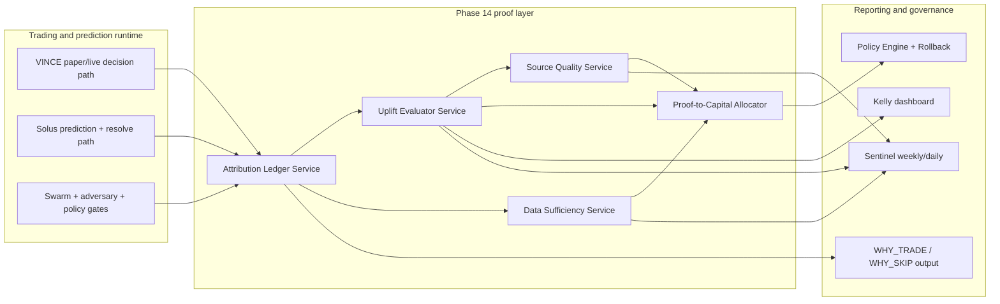

# PRD: Phase 14 — Proof-to-Capital Engine

**Status:** Proposed  
**Scope:** Continuous proof of recursive improvement (VINCE perps + Solus options), data sufficiency scoring, source quality attribution (X + Polymarket), and automatic risk-budget reallocation from measured edge.  
**Owner:** Sentinel (governance, scoreboards, rollout) with plugin-vince and plugin-solus (runtime + ML loop integration).  
**Related:** [README.md](../../../README.md), [PRD_PAPER_TRADING_ALGO_AND_ML.md](./PRD_PAPER_TRADING_ALGO_AND_ML.md), [PRD_ML_TRAINING_PIPELINE.md](./PRD_ML_TRAINING_PIPELINE.md), [PRD_LIVE_EXECUTION_GRADUATION.md](./PRD_LIVE_EXECUTION_GRADUATION.md), [FEATURE-STORE.md](../../FEATURE-STORE.md), [SOLUS.md](../../SOLUS.md), [SWARM_LEARNING_ARCHITECTURE.md](../../SWARM_LEARNING_ARCHITECTURE.md).

---

## 1. Problem and goal (plain English)

**Problem:** We have a self-improving architecture, but proof is fragmented. Improvement signals exist across model reports, post-mortems, swarm stats, and dashboards, yet we do not have a single runtime decision layer that says:

1. Is edge improving in a statistically credible way?
2. Which subsystem produced the uplift (or drag)?
3. Is there enough data to trust the conclusion?
4. Should risk budget increase, hold, or shrink right now?

Without this, capital sizing remains partly heuristic and slower than the system's learning speed.

**Goal:** Ship a production layer that continuously converts outcomes into **proof**, and proof into **risk allocation**. This closes the final operational gap between "learning system" and "capital allocator."

---

## 2. Product requirements (what Phase 14 must deliver)

### 2.1 Continuous uplift scoreboard (VINCE + Solus)

- Produce daily and weekly uplift snapshots by regime and sleeve:
  - `baseline_rule_based` vs `onnx_enabled`
  - `onnx_enabled` vs `onnx_plus_swarm`
  - `onnx_plus_swarm` vs `onnx_plus_swarm_plus_adversary`
- Metrics: win rate, expectancy, Sharpe proxy, max drawdown, calibration (Brier), and skip-quality (percent of skipped trades that were losers).
- Separate reporting for:
  - VINCE perps (Hyperliquid)
  - Solus assignment predictions (Hypersurface options)

### 2.2 Decision attribution ledger

- For every closed trade (or resolved option prediction), write a structured attribution record:
  - Which gate/model/input changed the decision?
  - If changed, what was the counterfactual path?
  - Was outcome better, worse, or neutral?
- Include source lineage tags (`x_research`, `polymarket`, `price_only`, `options_context`, `swarm_vote_mix`) so external-input quality is measurable.

### 2.3 Data sufficiency meter

- Runtime confidence grade (`LOW`, `MEDIUM`, `HIGH`) for each edge claim:
  - Global
  - By regime
  - By asset cluster
  - By source family (X, Polymarket, technicals, options flow)
- Require minimum sample counts and minimum time coverage before any promotion claim can trigger risk increase.

### 2.4 Source quality promotion/demotion

- Add a policy-aware source quality service:
  - Promote source weights only after sustained uplift over rolling windows.
  - Demote quickly when contribution decays or calibration drifts.
- Apply to:
  - Echo/X-derived features
  - Oracle/Polymarket-derived features

### 2.5 Proof-driven capital reallocator

- Introduce automatic budget shifts across sleeves/strategies:
  - Increase allocation to sleeves with validated uplift and healthy risk profile.
  - Freeze or shrink allocation where uplift is unproven or deteriorating.
- Guarded by existing policy engine and rollback orchestrator.

---

## 3. Non-goals (for this phase)

- No new exchange integrations or broker routing.
- No redesign of core signal generation framework.
- No replacement of the existing policy engine; this phase extends inputs into it.
- No "black-box" allocator changes that cannot be explained in `WHY_TRADE` style output.

---

## 4. Architecture (additive to current system)

---

## 5. Implementation plan (task breakdown)

### Workstream A — Data contracts and persistence

1. Define `ProofAttributionRecord` schema in plugin-vince and plugin-solus shared contract.
2. Extend feature-store close records with attribution fields (no breaking changes).
3. Add persistence adapters: JSON + DB tables for attribution and uplift snapshots.
4. Add migration scripts for new tables/indexes and backfill from recent history where possible.

### Workstream B — Uplift evaluator

5. Implement `UpliftEvaluatorService`:
   - Rolling windows (7d/30d/90d)
   - Regime-segmented uplift
   - Counterfactual comparisons between gate stacks
6. Add `ProofScore` output (0–100) plus confidence band and plain-language rationale.
7. Add parity checks to ensure calculations are deterministic across reruns.

### Workstream C — Data sufficiency meter

8. Implement `DataSufficiencyService`:
   - Sample thresholds by context (global/regime/source)
   - Time-span thresholds
   - Coverage checks (asset breadth, market conditions)
9. Emit `sufficiencyGrade` and `blockingReasons` for use by allocator and dashboards.

### Workstream D — Source quality service (X + Polymarket first)

10. Implement `SourceQualityService` with promotion/demotion logic and decay handling.
11. Integrate source quality adjustments into dynamic source weights with policy caps.
12. Add source-level calibration and lag metrics for X + Polymarket inputs.

### Workstream E — Proof-to-capital allocator

13. Implement `ProofToCapitalAllocatorService`:
    - Inputs: uplift, sufficiency, source quality, drawdown profile
    - Outputs: sleeve-level risk budget deltas
14. Wire allocator output into existing capital buckets and policy engine as a recommendation layer first, then gated auto-apply.
15. Add rollback hooks so allocator changes are reversible in one action.

### Workstream F — UX/reporting + tasks

16. Extend `/vince/paper` and relevant dashboard views with:
    - Proof score
    - Uplift by regime
    - Sufficiency grade
    - Top positive/negative contributors
17. Extend `VINCE_WHY_TRADE` / `WHY_SKIP` text blocks with concise proof attribution.
18. Add Sentinel tasks/actions:
    - Weekly proof digest
    - Auto-generated "insufficient data" collection tasks
    - Alert when source quality degrades sharply

---

## 6. Acceptance criteria (ship gate)

Phase 14 is complete only if all are true:

1. **Proof continuity:** Every closed VINCE trade and every resolved Solus prediction has an attribution record.
2. **Uplift visibility:** Dashboard and Sentinel report uplift metrics by regime for 7d/30d/90d windows.
3. **Sufficiency enforcement:** Risk-budget increases are blocked when sufficiency grade is `LOW`.
4. **Source accountability:** X and Polymarket source families show explicit quality score trend and weight history.
5. **Allocator control:** Proof-to-capital adjustments can run in:
   - `observe_only`
   - `recommendation`
   - `auto_apply` (policy-gated)
6. **Rollback tested:** One-command rollback reverts allocator-driven budget changes and logs incident metadata.
7. **No regressions:** Existing phase behavior remains unchanged when Phase 14 flags are disabled.

---

## 7. Metrics (what success looks like)

### Primary metrics

- Positive uplift persistence across rolling windows in at least two market regimes.
- Reduction in drawdown-adjusted underperformance episodes after allocator adoption.
- Higher calibration quality (lower Brier where applicable) without collapsing trade count.

### Secondary metrics

- Time-to-detect degraded source quality.
- Percent of budget changes explained by machine-readable proof records.
- Reduction in manual tuning interventions from operators.

---

## 8. Runtime flags and rollout

### New env flags (proposed)

- `VINCE_PHASE14_PROOF_ENGINE_ENABLED` (`false` default)
- `VINCE_PROOF_ATTRIBUTION_ENABLED` (`true` default when phase enabled)
- `VINCE_PROOF_ALLOCATOR_MODE` (`observe_only|recommendation|auto_apply`)
- `VINCE_PROOF_MIN_SUFFICIENCY_GRADE` (`MEDIUM` default)
- `VINCE_SOURCE_QUALITY_ENABLED` (`true` default when phase enabled)
- `SOLUS_PROOF_ENGINE_ENABLED` (`false` default; can roll out independently)

### Rollout sequence

1. **Week 1:** Attribution + uplift in observe-only mode.
2. **Week 2:** Sufficiency meter blocks only "increase risk" actions.
3. **Week 3:** Source quality promotion/demotion in recommendation mode.
4. **Week 4+:** Auto-apply allocator for one sleeve, then gradual expansion.

---

## 9. Risk analysis and mitigations

- **Risk:** Overfitting uplift to short windows.  
  **Mitigation:** Require multi-window consistency and sufficiency grade before promotions.

- **Risk:** Allocator thrash from noisy source metrics.  
  **Mitigation:** Hysteresis bands + max delta caps + cooldown between reallocations.

- **Risk:** Attribution overhead slows runtime.  
  **Mitigation:** Async writes with bounded queue and fallback to compact mode.

- **Risk:** Operator trust drops if outputs are opaque.  
  **Mitigation:** Always provide plain-language "why allocation changed" summaries.

---

## 10. Testing strategy

- Unit tests:
  - Uplift math and confidence scoring
  - Sufficiency grading logic
  - Source promotion/demotion rules
  - Allocator delta calculation and caps
- Integration tests:
  - End-to-end attribution from decision to close/resolve
  - Observe-only to recommendation path
  - Policy-gated auto-apply path
  - Rollback path with audit entries
- Scenario tests:
  - Regime flip stress test
  - Source drift shock (X quality collapse)
  - Sparse-data environment

---

## 11. Open questions to resolve before build

1. Should Solus and VINCE share one proof score framework or keep separate domain calibrations with a combined top-line score?
2. What is the minimum acceptable sample size for regime-level claims in volatile regimes?
3. Should source quality demotion be symmetric (same speed as promotion) or faster on decay?
4. In live mode, should allocator auto-apply require two consecutive proof windows?

---

## 12. One-line summary

Phase 14 adds a proof layer that measures true uplift, verifies data sufficiency, and automatically reallocates risk toward validated edge while preserving policy safety and rollback control.
