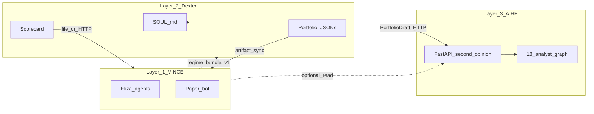

# PRD: Three-layer stack, cross-repo data flow, and production readiness

**Status:** Draft — for implementation planning  
**Repos:** [vince](https://github.com/eliza420ai-beep/vince) (this project), [dexter](https://github.com/eliza420ai-beep/dexter), [ai-hedge-fund](https://github.com/eliza420ai-beep/ai-hedge-fund)  
**Related:** [docs/DEPLOY.md](../../DEPLOY.md), [docs/DEXTER-PORTFOLIO-SYNC.md](../../DEXTER-PORTFOLIO-SYNC.md), [docs/GUARDRAILS.md](../../GUARDRAILS.md), [railway.toml](../../../railway.toml)

---

## 1. Problem statement

We run three codebases that map to one investment operating system:

| Layer | Time horizon | Repo | Job |
|-------|----------------|------|-----|
| **Layer 1 — VINCE** | Hours → weeks | vince (ElizaOS) | Monitor OI, funding, L/S, HL tickers, options ritual (Solus), surface short-horizon signals; paper bot and agents. |
| **Layer 2 — Dexter** | Months → years | dexter | Hold the thesis (`SOUL.md`), build sleeves, rebalance discipline, quarterly attribution vs BTC/SPY/GLD; broker-aware (tastytrade, HL). |
| **Layer 3 — AIHF** | Cycle-scale | ai-hedge-fund | 18-analyst second opinion, conviction challenge, Sharpe-oriented autoresearch; FastAPI service for async runs. |

**Challenge:** Operators need confidence that (a) data and decisions flow across layers without manual copy-paste, and (b) a public or shared deployment does not burn LLM/API tokens or leak secrets.

---

## 2. Goals

1. **Contract-first integration:** Every cross-repo handoff has a named producer, consumer, format, cadence, and failure behavior.
2. **Automated sync where it matters:** Portfolio universe, scorecard, and optional regime/signal bundles move from Dexter → VINCE and Dexter ↔ AIHF without ad-hoc steps.
3. **Close the Layer-1 → Layer-2 loop:** VINCE can emit structured “regime / signal summaries” that Dexter (or a small Dexter-side ingest) can consume for re-underwriting.
4. **Optional Layer-1 ↔ Layer-3:** Chat and reports can reference latest AIHF disagreement buckets when a run exists (HTTP pull or artifact).
5. **Production-ready VINCE deploy:** Railway (or equivalent) with durable DB, gated access to token-spend paths, observability, and a minimal test + smoke discipline.

**Non-goals (v1):**

- Merging the three repos into one monorepo (optional later; not required for data flow).
- Fully automated live execution across all venues from VINCE alone (execution stays gated and venue-specific per existing PRDs).

---

## 3. Current state (as of PRD draft)

### 3.1 VINCE ↔ Dexter (partially implemented)

- **Portfolio JSONs:** VINCE reads `portfolio_hyperliquid.json`, `portfolio_tastytrade.json`, `portfolio_watchlist.json` from the process working directory; same intent as Dexter. See [docs/DEXTER-PORTFOLIO-SYNC.md](../../DEXTER-PORTFOLIO-SYNC.md) and `src/plugins/plugin-vince/src/utils/dexterPortfolio.ts`.
- **Scorecard / cache:** VINCE can load Dexter scorecard and related enrichment (`dexterScorecard`, `dexterCacheImport`, `VINCE_DEXTER_CACHE_IMPORT`).
- **Drift:** Users can ask VINCE about Dexter drift vs paper universe ([docs/GUARDRAILS.md](../../GUARDRAILS.md)).
- **Gap:** Sync is often manual (copy/symlink/cwd). No standard env for “Dexter root URL or path,” no CI job documented in-repo for “pull latest JSONs into deploy artifact.”

### 3.2 Dexter ↔ AIHF (documented in sibling repos)

- Dexter’s README describes the three-layer stack and points to AIHF.
- AIHF exposes FastAPI second-opinion flow: `POST /api/v1/second-opinion/runs`, poll, `.../result` (see [ai-hedge-fund](https://github.com/eliza420ai-beep/ai-hedge-fund) README, `DEXTER_INTEGRATION.md`, `scripts/dexter_second_opinion_client.py`).
- **Gap:** Production URL, auth, and network placement (private vs public) are operator-specific and should be captured in env + this PRD’s runbook section.

### 3.3 VINCE ↔ AIHF

- **Gap:** No first-class plugin action or provider that fetches “last second opinion” or triggers a run from Eliza. Optional v1: read-only display of cached JSON artifact written by a scheduled job.

---

## 4. Integration architecture

### 4.1 Principles

- **Polyrepo + contracts** over forced monorepo: each service keeps its release cycle; integration via versioned JSON schemas and OpenAPI-aligned HTTP where needed.
- **Artifact lane** for batch, low-latency-tolerant data (portfolios, scorecards, reports).
- **API lane** for on-demand second opinions and (optional) live scorecard reads (Dexter exposes `GET /api/scorecard` when its HTTP server runs).



### 4.2 Integration matrix (target)

| Flow | Producer | Consumer | Mechanism | Cadence | Auth |
|------|-----------|-----------|-----------|---------|------|
| Portfolio universe | Dexter | VINCE | Files in cwd **or** `DEXTER_ARTIFACT_ROOT` / sync job | On Dexter rebalance / suggest | N/A (files) |
| Scorecard | Dexter (`bun run score`) | VINCE | `.dexter/scorecard.json` copied/synced **or** `GET /api/scorecard` | Daily / weekly | API key if HTTP |
| FD cache hints | Dexter `.dexter/cache` | VINCE | Optional import (`VINCE_DEXTER_CACHE_IMPORT`) | On demand | N/A |
| Second opinion | Dexter / scripts | AIHF | `POST /api/v1/second-opinion/runs` + poll | On sleeve review | Bearer / internal network |
| Regime / signal summary | VINCE | Dexter | **New:** JSON file drop or `POST` webhook (Dexter or sidecar) | Hourly / daily / on alert | Shared secret |
| Committee snapshot | AIHF | VINCE | **New:** Artifact path **or** `GET` last run summary | After each run | Same as AIHF API |

---

## 5. Phased delivery

### Phase A — Documentation and operator runbook (no code or minimal)

- [x] Single runbook page: [docs/DEXTER_ARTIFACT_SYNC_RUNBOOK.md](../../DEXTER_ARTIFACT_SYNC_RUNBOOK.md) (sync, `DEXTER_ARTIFACT_ROOT`, Railway, cache import).
- [x] Env vars surfaced in runbook + [.env.example](../../../.env.example) for `DEXTER_ARTIFACT_ROOT` / `VINCE_DEXTER_CACHE_IMPORT`; production table remains in Phase E / [DEPLOY.md](../../DEPLOY.md).
- [x] Decision documented: local files-in-repo vs symlink, `DEXTER_ARTIFACT_ROOT`, CI/rsync pre-start, Railway copy/mount.

**Exit:** A new engineer can wire sync in under 30 minutes.

### Phase B — VINCE hardening for artifact root

- [x] Optional env `DEXTER_ARTIFACT_ROOT` in `dexterPortfolio.ts`, scorecard loader, cache import source root, `top100Enrichment` scorecard calls.
- [x] One startup log line via `logDexterArtifactResolutionOnce` in `plugin-vince` `init`.
- [x] Tests: existing soft-fail loaders; `resolveDexterArtifactRoot` when env set; scorecard prefers `.dexter/scorecard.json`.

**Exit:** Railway deploy can mount or unpack Dexter artifacts into a known path without copying into repo root.

### Phase C — Layer-1 → Layer-2 handoff (regime bundle v1)

- [x] Define JSON schema `regime_bundle_v1`: e.g. `generated_at`, `universe_hash`, per-asset or per-sleeve flags (funding stress, OI change bucket, regime label), optional “alerts” list.
- [x] VINCE: task or action that writes bundle to configurable path (`REGIME_BUNDLE_OUT_PATH`) or `POST`s to `DEXTER_REGIME_WEBHOOK_URL` with `Authorization: Bearer <secret>`.
- [x] Dexter (sibling repo) or small **ingest service**: document or implement one consumer (file watcher or single POST route). *If ingest lives only in Dexter, track as cross-repo issue.*

- [x] Define JSON schema `regime_bundle_v1`: `docs/regime_bundle_v1.schema.json`.
- [x] VINCE: task or action that writes bundle to configurable path (`REGIME_BUNDLE_OUT_PATH`) (file drop MVP).
- [x] Dexter (sibling repo) or small **ingest service**: consumer contract + local ingest/validator shim here so you can verify end-to-end without Dexter.

**Exit:** After a VINCE standup or scheduled task, Dexter operators see a fresh bundle for `/weekly` / thesis review.

### Phase D — VINCE read path for AIHF (optional)

- [x] If AIHF can write `last_second_opinion_summary.json` to a shared bucket or path, VINCE provider loads it into context (truncated) for “what does the committee think?”
- [x] Alternatively: server-side fetch with timeout from `AIHF_BASE_URL` read-only endpoint (HTTP read integration).

Recommended ops: run `scripts/refresh-aihf-last-second-opinion-alias.ts` after each AIHF run (or via cron) so `last_second_opinion_summary.json` always points to the newest `second_opinion_run_result_*.json`.

Cron example (runs every 10 minutes):

```cron
*/10 * * * * AIHF_ARTIFACT_ROOT=/Users/macbookpro16/Documents/stocks/ai-hedge-fund/second_opinion_runs bun run scripts/refresh-aihf-last-second-opinion-alias.ts --mode copy
```

**Exit:** Kelly/VINCE answers can cite agree/disagree buckets when file is fresh (< N days).

### Phase E — Production readiness (VINCE on Railway)

Aligned with [docs/DEPLOY.md](../../DEPLOY.md):

1. **Staging:** Railway project with `POSTGRES_URL`, `JWT_SECRET`, model keys; smoke: health, one auth’d chat, redeploy persistence check. **Checklist:** [API_SECURITY_AND_PRODUCTION.md § Railway staging](../../API_SECURITY_AND_PRODUCTION.md#8-railway-staging-checklist-operator) (operator-run; cannot be automated from repo alone).
2. **Persistence:** PGLite-only is ephemeral on redeploy; use Postgres for production truth if rooms/agents matter.
3. **Token / access gating:** [x] Audit documented: [API_SECURITY_AND_PRODUCTION.md](../../API_SECURITY_AND_PRODUCTION.md) (`ELIZA_SERVER_AUTH_TOKEN`, `ENABLE_DATA_ISOLATION` + JWT, Socket.IO, rate limits, LLM burn paths). [x] Edge allowlist (e.g. Cloudflare Access) documented with a concrete edge-first checklist.
4. **Observability:** [x] Documented (`LOG_LEVEL`, Sentry vars, `/healthz` probes); [x] Railway health target + spend alerts wired via `SPEND_ALERT_BREACH` log line + `VINCE_SPEND_ALERT_MONTHLY_USD` configuration.
5. **Tests:** [x] `scripts/verify-api-gating.sh`; opt-in `VINCE_API_GATING_TEST=1` + `src/__tests__/apiGating.e2e.test.ts`. Keep `bun run type-check` + `bun test` in CI.

**Exit:** Staging sign-off checklist signed; prod deploy behind gate; no anonymous token burn.

---

## 6. Success metrics

| Metric | Target |
|--------|--------|
| Portfolio drift | VINCE context matches Dexter JSONs within one sync cadence (e.g. same day). |
| Second opinion | Dexter → AIHF smoke completes with `COMPLETE` and non-null decisions (existing client script). |
| Regime bundle | At least one automated emission per day (or on alert) when enabled. |
| Prod security | Unauthenticated requests cannot trigger chat/LLM on staging (verified by curl). |
| Restore | Redeploy + Postgres: user sessions / critical data survive (if Postgres chosen). |

---

## 7. Risks and mitigations

| Risk | Mitigation |
|------|------------|
| cwd mismatch on Railway | `DEXTER_ARTIFACT_ROOT` + explicit sync step in deploy |
| Stale scorecard | Dexter’s `stale` flag + UI/agent text “run `bun run score`” |
| AIHF latency / cost | Async runs only; cache last result; do not block chat on committee |
| Secret leakage | Railway vars only; no keys in frontend bundle; private networking between services where possible |
| Cross-repo drift | Version `regime_bundle_v1`; bump version when breaking |

---

## 8. Open questions

1. Where does **SOUL.md** live for RAG: VINCE knowledge only, or symlink from Dexter?
2. Should **scorecard** prefer HTTP (Dexter server) or file (simpler on Railway)?
3. Who owns **ingest** for regime bundles: Dexter repo PR vs minimal standalone `dexter-ingest` service?

---

## 9. References

- [Dexter](https://github.com/eliza420ai-beep/dexter) — thesis, sleeves, `GET /api/scorecard`, CLI shortcuts, VINCE.md in repo.
- [AI Hedge Fund](https://github.com/eliza420ai-beep/ai-hedge-fund) — second-opinion API, autoresearch, `DEXTER_INTEGRATION.md`.
- [docs/DEPLOY.md](../../DEPLOY.md) — Eliza Cloud / Railway, Postgres vs PGLite.
- [docs/DEXTER-PORTFOLIO-SYNC.md](../../DEXTER-PORTFOLIO-SYNC.md) — current file contract.

---

## 10. Revision history

| Date | Author | Change |
|------|--------|--------|
| 2026-03-20 | — | Initial draft: three-layer stack + integration matrix + prod gates + phased plan |
