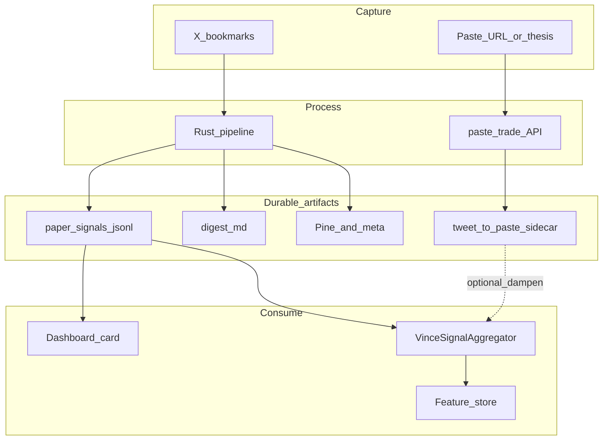

# PRD: X bookmarks, paste.trade, and paper-bot overlay — improvements

**Status:** Draft — for prioritization and sequencing  
**Repo:** [vince](https://github.com/IkigaiLabsETH/vince)  
**Related:** [docs/X-BOOKMARKS-PIPELINE.md](../../X-BOOKMARKS-PIPELINE.md), [README.md](../../../README.md) § From X bookmarks to trades, [packages/paste-trade/ARCHITECTURE.md](../../../packages/paste-trade/ARCHITECTURE.md), [src/plugins/plugin-vince/src/utils/xBookmarksPaperQueue.ts](../../../src/plugins/plugin-vince/src/utils/xBookmarksPaperQueue.ts)

---

## 1. Problem statement

We shipped a **bookmark → Rust pipeline → Pine + digest + paper-signals JSONL → `XBookmarks` aggregator vote** path, and documented how it differs from **paste.trade** (single-source → thesis cards → tracked prices). Operators still face:

| Pain | Why it hurts |
| ---- | ------------ |
| **High activation cost** | Rust + four LLM provider keys + X `bookmark.read` scope + numeric `X_FETCH_USER_ID` — many steps before the first successful run. |
| **Manual trigger** | Nothing runs on bookmark alone; easy to accumulate unread bookmarks and stale intent. |
| **Two silos** | Bookmark pipeline output (Pine, `.meta.json`) and paste.trade (live source pages, routed trades) do not reference each other; duplicate research is likely. |
| **Weak observability** | Paper overlay is a JSONL file + log lines; no first-class UI, no per-tweet revoke, no “why did the bot lean long here?” link back to bookmark. |
| **Attribution gap** | Feature store / “WHY THIS TRADE” can show `XBookmarks` but not yet tie cleanly to **tweet id**, **Pine path**, or **paste.trade post id** for post-mortems. |
| **Weight governance** | Fixed weight (0.48) and TTL (72h default); no per-user caps, no “bookmark tier” vs “paste.trade confirmed” distinction in one model. |

---

## 2. Goals

1. **Lower time-to-first-value** for the bookmark lane: fewer env vars, clearer errors, optional “cloud worker” or CI job so the Mac mini is not the only runtime.
2. **Close the loop between bookmark harvest and paste.trade depth**: one command or chat intent from a **tweet URL** → optional fork into paste.trade enrichment without retyping.
3. **Make paper-overlay signals auditable**: surface tweet link + rationale in dashboard or structured log; allow **revoke / expire** without editing JSONL by hand.
4. **Improve ML and post-mortem usefulness**: persist `tweet_id`, `source_meta_path`, optional `paste_trade_id` on feature-store rows when `XBookmarks` contributed.
5. **Operational safety**: explicit caps (max bookmarks per run, max overlay strength, kill switch per asset) so saved CT noise cannot dominate the sim.

**Non-goals (this PRD):**

- Auto live execution from bookmarks or paste.trade without a separate execution PRD and human/ Otaku gates.
- Replacing the Rust pipeline with a full in-TypeScript port (optional long-term; out of scope unless we decide cost/latency requires it).
- Building a full TradingView competitor inside VINCE.

---

## 3. Current state (summary)

| Component | Behavior today |
| --------- | -------------- |
| **Pipeline** | Vendored `packages/x-bookmarks-pipeline`; `cargo run` via CLI or **VINCE** `X_BOOKMARKS_PIPELINE` action (`X_BOOKMARKS_PIPELINE_ENABLED=true`). |
| **Artifacts** | `data/x-bookmarks-pipeline/output/**`, `digest/latest.md`, `paper-signals.jsonl` (gitignored tree). |
| **Paper bot** | `VinceSignalAggregator` injects **`XBookmarks`** per asset from latest row in TTL window; weight **0.48** in `dynamicConfig.ts`. |
| **paste.trade** | `plugin-paste-trade`; URL/thesis → API; streaming cards; profile P&L story — parallel product lane per README. |
| **Docs** | README UX section + `docs/X-BOOKMARKS-PIPELINE.md`. |

---

## 4. Target experience (north star)

**Operator story:** *I bookmark on X throughout the day. Once a day (or on demand), my stack turns those into (1) Pine I can paste into TradingView, (2) a one-page digest I can skim, (3) a gentle paper-bot bias aligned with tickers I actually trade, and (4) for the two posts I care most about, I can “send to paste.trade” and get tracked cards without redoing research. Six months later, a post-mortem shows which bookmark ids moved the sim and which were noise.*

---

## 5. Proposed improvements (phased)

### Phase A — Friction and reliability (highest ROI)

| ID | Deliverable | Acceptance criteria |
| -- | ----------- | ------------------- |
| A1 | **Setup wizard doc + script** | Single `docs/X-BOOKMARKS-PIPELINE.md` “15-minute setup” with copy-paste checks: `cargo --version`, `bookmark.read` scope, resolve `X_FETCH_USER_ID` from username via documented one-liner or small script. |
| A2 | **Env consolidation** | Document mapping: reuse `OPENAI`/`ANTHROPIC` from VINCE `.env`; track upstream issue or fork patch to make **Cerebras + xAI** optional if user chooses “Claude-only” profile (depends on Rust crate). |
| A3 | **Action error messages** | `X_BOOKMARKS_PIPELINE` returns actionable text: missing key name, missing `X_FETCH_USER_ID`, `cargo` not found, empty output dir — no generic failure. |
| A4 | **Scheduled run (optional)** | Cron-friendly `bun run x-bookmarks:fetch` + optional Eliza **task** (VINCE or headless) with `STANDUP_*`-style env for hour interval; failure posts to Discord webhook optional. |

### Phase B — Bookmark ↔ paste.trade bridge

| ID | Deliverable | Acceptance criteria |
| -- | ----------- | ------------------- |
| B1 | **“Paste this tweet to paste.trade”** action or slash flow | From chat: given `x.com/.../status/...`, call paste.trade **create** path with that URL; return live link to source page. Requires `PASTE_TRADE_*` configured. |
| B2 | **Cross-reference in digest** | `digest/latest.md` includes optional column “Open in paste.trade” when user ran B1 for that `tweet_id` (local sidecar JSON mapping `tweet_id → paste_url`). |
| B3 | **Single PRD-weighted priority** | Define rule: **paste.trade posted trade** for asset A **supersedes** or **dampens** `XBookmarks` row for same asset from same day (configurable). |

### Phase C — Observability and control

| ID | Deliverable | Acceptance criteria |
| -- | ----------- | ------------------- |
| C1 | **Leaderboard or Bot card: “Bookmark overlay”** | Read-only panel: last N rows from `paper-signals.jsonl` (asset, direction, age, tweet link, validation flag). |
| C2 | **Revoke API / action** | `VINCE_BOOKMARK_OVERLAY_REVOKE=tweet_id` or chat “revoke bookmark signal &lt;id&gt;” removes or marks stale lines (implement as append “tombstone” line or rewrite with filter — document semantics). |
| C3 | **Per-asset cap** | Env `X_BOOKMARKS_MAX_STRENGTH` / `X_BOOKMARKS_MAX_CONFIDENCE` clamp after decay. |

### Phase D — Feature store and learning

| ID | Deliverable | Acceptance criteria |
| -- | ----------- | ------------------- |
| D1 | **Decision driver payload** | When `XBookmarks` contributes, `recordDecision` (or equivalent) stores `bookmarkTweetId`, `paperSignalIngestedAt`, `validation_passed` from meta. |
| D2 | **Training export** | Improvement report section: overlay contribution rate, win rate conditional on `XBookmarks` present vs absent (when sample size allows). |
| D3 | **paste.trade id optional** | If B1 stores mapping, persist `pasteTradeSourceId` on overlay row for joint attribution. |

### Phase E — Scale and deployment (optional)

| ID | Deliverable | Acceptance criteria |
| -- | ----------- | ------------------- |
| E1 | **Headless worker image** | Dockerfile stage with Rust + minimal runtime; run pipeline on schedule in Railway/Cron; write artifacts to mounted volume or S3-compatible bucket; VINCE reads queue path from env. |
| E2 | **Rate and cost budgets** | Expose pipeline’s X API budget envs in VINCE docs; alert when `cost_report.md` exceeds weekly threshold. |

---

## 6. Architecture sketch (target)

---

## 7. Success metrics

| Metric | Instrument | Target (directional) |
| ------ | ---------- | ---------------------- |
| Setup completion | Doc checklist self-report + support threads | Fewer “missing env” failures in first session |
| Pipeline runs / week | Log counter or digest file mtime | Stable or increasing with operator intent |
| Overlay contribution rate | % of paper opens where `sources` includes `XBookmarks` | Bounded (e.g. &lt; 25% of opens) unless A/B says value |
| Joint paste.trade usage | B1 invocations / bookmark runs | Increasing when B1 ships |
| Post-mortem traceability | % of losing trades with bookmark id when XBookmarks contributed | 100% after D1 |

---

## 8. Risks and mitigations

| Risk | Mitigation |
| ---- | ---------- |
| CT bookmarks are noisy; overlay skews sim | C3 caps + short TTL + WTT / paste.trade dampening rules |
| Four LLM keys remain mandatory in Rust | A2 upstream negotiation or fork; document cost tradeoff |
| JSONL manual edit breaks parser | Schema version + tombstone records + validate on read |
| paste.trade downtime blocks B1 | Graceful fallback message; queue bookmark-only path |

---

## 9. Open questions

1. Should **ECHO** or **Eliza** ever run the pipeline, or stay **VINCE-only** for clarity?
2. Do we want **one unified “alpha inbox”** table (Postgres) instead of JSONL for multi-machine deploy?
3. Should Pine scripts be **versioned in git** (opt-in export) for team review, or always stay local under `data/`?
4. Legal/TOS: automated bookmark processing vs paste.trade content terms — need one-pager in `docs/`?

---

## 10. Suggested sequencing

1. **Now → A1, A3, A4** (docs, errors, schedule)  
2. **Next → C1, C2, D1** (visibility, revoke, feature store)  
3. **Then → B1–B3** (paste.trade bridge and priority rules)  
4. **Later → E1–E2** (hosted worker, cost alerts)

---

## 11. References

- [docs/X-BOOKMARKS-PIPELINE.md](../../X-BOOKMARKS-PIPELINE.md)  
- [README.md](../../../README.md) — “From X bookmarks to trades”  
- [src/plugins/plugin-vince/SIGNAL_SOURCES.md](../../../src/plugins/plugin-vince/SIGNAL_SOURCES.md) — `XBookmarks`  
- [packages/paste-trade/README.md](../../../packages/paste-trade/README.md)  
- Upstream pipeline: [x-bookmarks-pipeline](https://github.com/eliza420ai-beep/x-bookmarks-pipeline)
