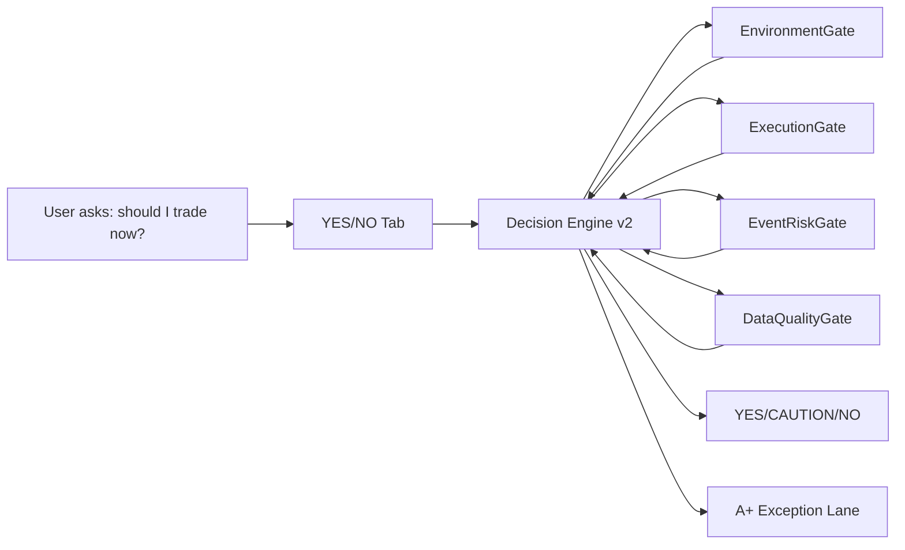

# PRD: YES/NO Tab — US Equity Risk Gate (v2)

**Status:** Draft  
**Scope:** US equities discretionary trading gate, with explicit `YES/CAUTION/NO` semantics and an `A+` exception path.  
**Owner:** Plugin-vince (UX + gate policy + data wiring).  
**Date:** 2026-03-19  
**Related:**  
- [src/frontend/components/dashboard/leaderboard/yesno-tab.tsx](/Users/macbookpro16/vince/src/frontend/components/dashboard/leaderboard/yesno-tab.tsx)  
- [src/plugins/plugin-vince/src/services/yesNoMarketService.ts](/Users/macbookpro16/vince/src/plugins/plugin-vince/src/services/yesNoMarketService.ts)  
- [src/plugins/plugin-vince/src/utils/stockIndicators.ts](/Users/macbookpro16/vince/src/plugins/plugin-vince/src/utils/stockIndicators.ts)  
- [src/plugins/plugin-vince/src/services/newsSentiment.service.ts](/Users/macbookpro16/vince/src/plugins/plugin-vince/src/services/newsSentiment.service.ts)  
- [src/plugins/plugin-vince/src/utils/wttQualityScore.ts](/Users/macbookpro16/vince/src/plugins/plugin-vince/src/utils/wttQualityScore.ts)  

---

## 1. Goal
Make the `YES/NO` tab answer one question, cleanly and conservatively:

**Should I be trading now?** (US equities discretionary trading)

In this PRD:
- `NO` must mean **no discretionary trading**, except **A+ setups**.
- `YES` means discretionary trading is permitted under the same risk rules as usual (normal size/process).
- `CAUTION` means discretionary trading is permitted but should be treated as lower-conviction (smaller size and/or fewer attempts).

---

## 2. Problem (current state)
The current tab is visually aligned to “should I trade?”, but the underlying decision behavior is closer to “is the US equity tape somewhat supportive?”.

### 2.1 Decision/score mismatch (high severity)
- The backend computes `executionWindowScore` and displays it.
- The final `YES/CAUTION/NO` decision is derived from `marketQualityScore` only.

In `src/plugins/plugin-vince/src/services/yesNoMarketService.ts`, the gate is effectively:
- `decision = marketQualityDecision(marketQualityScore)`
- `executionWindowScore` is calculated but not used in the decision.

This makes the UI feel like it is gating on “setups working” while the system is not.

### 2.2 Day mode semantics (high severity)
The tab’s `mode` toggle (`swing` vs `day`) only changes lookback/pivot parameters while still relying on daily bars from Yahoo Finance.

That means `day` does not represent “right now / intraday risk conditions”, so a user interpreting it as a true intraday gate gets a misleading signal.

### 2.3 Event risk blockers are stubbed (medium severity)
The UI already has an “alert banner” area.
The backend currently returns `alert: null`, so event-risk guidance does not actually block trading.

### 2.4 Breadth proxy is not true breadth (medium severity)
“Breadth” is a proxy based on sector ETF participation (lead/lag from the same ETF basket used for momentum).

This is acceptable for a coarse tape filter, but it should not be presented as “market breadth” without the proxy framing.

### 2.5 Failure mode is not explicit enough for a binary permission gate
Missing/partial data often collapses to neutral/0 scoring, which can make the UI feel “confident” when the inputs are unreliable.

---

## 3. Product Definition: `YES/CAUTION/NO` semantics (v2)
### 3.1 Decision meanings
The tab produces:
- `YES`: discretionary trading is permitted (normal process).
- `CAUTION`: discretionary trading is permitted with constraints (smaller size, fewer entries, and confirmation required).
- `NO`: no discretionary trading; only A+ setups may be traded.

### 3.2 “A+ setup” definition for this tab
For v2, `A+ setups` must be defined in terms of existing internal logic so the exception is machine-verifiable.

This PRD defines **A+ setups** as either of the following (implementation can start with the first, and add the second later):
1. **WTT A+**: a WTT pick whose computed quality band is `auto_eligible` (see `getBand(score)` where `score >= 80`) in `src/plugins/plugin-vince/src/utils/wttQualityScore.ts`.  
   - This is the cleanest “exception lane” because it is already scored and stored.
   - `NO` must not override WTT A+ eligibility.
2. **Paper-bot A+** (future): per-asset signal that passes the strictest paper-bot gates (ML quality + suggested min strength/confidence + risk manager validation) and is therefore “high-confidence open”.

If neither is available, `NO` blocks discretionary trading completely.

### 3.3 What `NO` forbids (explicitly)
When the UI shows `NO`, it forbids:
- discretionary entries opened based only on the tape filter;
- “hedged discretionary” entries unless they map to an A+ setup definition above.

---

## 4. Proposed v2 solution (high level)
Replace the current “single weighted score → decision” approach with a **sequential risk gate** that matches the product intent.

Decision must be derived from ordered checks:
1. **EnvironmentGate** (tape supportive for US equities)
2. **ExecutionGate** (setups likely to be tradable now, not just “in theory”)
3. **EventRiskGate** (macro/news/event risk actively present)
4. **DataQualityGate** (inputs fresh and complete enough to issue a permission)

Additionally, the tab must show **A+ exception lane**:
- If A+ setups exist, show them even when the discretionary decision is `NO`.

---

## 5. Decision engine architecture

### 5.1 Gate definitions
#### 5.1.1 EnvironmentGate (US equity tape filter)
Use existing `marketQualityScore` components as a starting point:
- volatility
- trend
- momentum
- breadth proxy
- macro proxy

But the gate must be **fail-closed**:
- if required series are missing or stale, treat as gate failure → `NO`.

Deliverable for v2:
- define explicit pass thresholds for `YES` and `CAUTION`.

#### 5.1.2 ExecutionGate (setup working-ness)
In v1, `executionWindowScore` is computed but not used.
In v2, execution must participate:
- `YES` should require execution confidence above a threshold.
- `CAUTION` can allow execution partial pass.
- `NO` if execution is clearly failing.

Deliverable for v2:
- define `executionWindowScore` thresholds by mode (initially, both modes use the same daily-bar logic but execution must still gate).

#### 5.1.3 EventRiskGate (hard blockers)
Event-risk must produce explicit blockers and/or penalties.

Data source (implementation path):
- Use `VinceNewsSentimentService.getActiveRiskEvents()` / `getActiveRiskEventsForAsset("MARKET")` to detect active risk events.
- `RiskEvent.severity` is `critical | warning | info`, with a 4-hour freshness window.

Gate rule:
- `critical`: block discretionary → `NO`.
- `warning`: downgrade to `CAUTION` (do not allow `YES` while warning risk is active).
- `info` / none: no event penalty.

Deliverable for v2:
- wire event risk result into the `alert` payload so the UI shows blockers, not null.

#### 5.1.4 DataQualityGate (stale/partial = NO)
This gate prevents false confidence.

Rules:
- If `updatedAt` is older than a freshness threshold (example: 60 seconds) → `NO`.
- If any required component series is null (example: missing SPY price, missing VIX percentile, missing sector returns count) → `NO`.
- If breadth proxy requires N sector ETF returns and fewer than N are available → `NO`.

Deliverable for v2:
- expose “inputs freshness” and “inputs completeness” to the UI (at least as pass/fail labels).

### 5.2 Mode policy (`swing` vs `day`)
For v2, the UI must not pretend “day mode” is intraday if it is not.

Two acceptable options:
1. **Swing-only v2:** remove or disable the `day` toggle; both users and product semantics map to swing permission.
2. **Label truthfully:** keep the toggle but relabel it (or show a subtitle) to indicate “Daily close risk gate”, not intraday.

This PRD recommends **Option 2** as minimal UI disruption, and explicitly requires a copy change so the user understands what “now” means.

---

## 6. UX requirements (UI must reflect gates, not just scores)
### 6.1 Top-level hero
Replace “Market Quality Score” + “Execution Window Score” as the primary narrative with:
- a dominant `YES/CAUTION/NO` badge that is clearly the discretionary permission verdict;
- a short “why” paragraph that references the gate(s) that failed or passed;
- a “blockers” area that lists the specific gate failures when verdict is `NO` or `CAUTION`.

### 6.2 Gate verdict chips/rows (required)
Add four explicit items (can reuse existing card layout):
- EnvironmentGate: PASS/FAIL (+ 1 sentence)
- ExecutionGate: PASS/FAIL (+ 1 sentence)
- EventRiskGate: PASS/FAIL (+ named risk if available)
- DataQualityGate: PASS/FAIL (+ freshness/completeness summary)

### 6.3 ExecutionWindowScore should matter
If `executionWindowScore` is below threshold, users must see it as a blocker or downgrade contributor.
Never show it as a decorative metric that cannot change the decision.

### 6.4 `A+ exception lane` display (required)
Add a section:
- `A+ exception available: YES/NO`
- If YES, display:
  - ticker (or primary/alt),
  - direction,
  - WTT quality band (`auto_eligible`) or paper-bot strict pass (depending on implementation).

When verdict is `NO`, the UI must still provide the “A+ lane” so users can act without ambiguity.

---

## 7. Data requirements
### 7.1 US equity tape inputs (existing, provisional)
Initial v2 can reuse the current Yahoo Finance set used by `YesNoMarketService`:
- `SPY`, `QQQ`
- `^VIX`
- `DX-Y.NYB`, `^TNX`
- US sector ETFs list used for the breadth/momentum proxy

### 7.2 Event risk inputs (new)
EventRiskGate inputs:
- active risk events from `VinceNewsSentimentService` with 4-hour freshness.

### 7.3 Freshness and “fail closed”
The PRD requires that missing inputs do not produce neutral “looks fine” outcomes.
For a permission gate, missing input must block discretionary trading.

---

## 8. Rollout plan
### Phase 1 (v2 gate semantics)
- Introduce sequential gate logic (EnvironmentGate + ExecutionGate).
- Ensure `executionWindowScore` is part of the verdict.
- Implement DataQualityGate fail-closed behavior.

### Phase 2 (event risk)
- Wire EventRiskGate and populate the `alert` payload when event risk is active.
- Update UI blockers/copy to reference the gate.

### Phase 3 (mode truthfulness)
- Either disable `day` or relabel it as “Daily close risk gate”.

### Phase 4 (A+ exception integration)
- Implement A+ exception by reading WTT pick and scoring it with `getBand(score)`:
  - `A+ available` if WTT band is `auto_eligible`.
- Display A+ details even when verdict is `NO`.

---

## 9. Acceptance criteria
1. The `YES/NO` verdict is derived from gate logic where `executionWindowScore` can change the final decision.
2. `NO` explicitly means **no discretionary trading except A+ setups**.
3. The UI shows which gates failed when verdict is `NO` or `CAUTION`.
4. EventRiskGate exists in v2 and blocks/waswo behavior:
   - `critical` event risk → `NO` (discretionary blocked)
   - `warning` → `CAUTION` (discretionary downgraded)
5. DataQualityGate is fail-closed and prevents issuing YES/CAUTION on stale/partial inputs.
6. A+ exception lane is visible and actionable:
   - when verdict is `NO`, the UI still shows A+ setup details if available.
7. Copy avoids misrepresenting `day` mode as intraday truth.

---

## 10. Out of scope (for this PRD)
- Intraday data integration (VWAP, volume profile, order-book depth) beyond “truthful relabeling” if not available yet.
- Full trade execution policy changes (this PRD governs the UI and risk gate semantics, not order execution).
- Replacing the existing tape proxy with true advancer/decliner breadth until a dedicated breadth provider is integrated.

---

## 11. References
- v1 UI rendering and field naming: [yesno-tab.tsx](/Users/macbookpro16/vince/src/frontend/components/dashboard/leaderboard/yesno-tab.tsx)
- v1 decision computation and executionWindowScore mismatch: [yesNoMarketService.ts](/Users/macbookpro16/vince/src/plugins/plugin-vince/src/services/yesNoMarketService.ts)
- v1 scoring utility thresholds and clamps: [stockIndicators.ts](/Users/macbookpro16/vince/src/plugins/plugin-vince/src/utils/stockIndicators.ts)
- event-risk detection plumbing: [newsSentiment.service.ts](/Users/macbookpro16/vince/src/plugins/plugin-vince/src/services/newsSentiment.service.ts)
- WTT A+ quality definition: [wttQualityScore.ts](/Users/macbookpro16/vince/src/plugins/plugin-vince/src/utils/wttQualityScore.ts)

